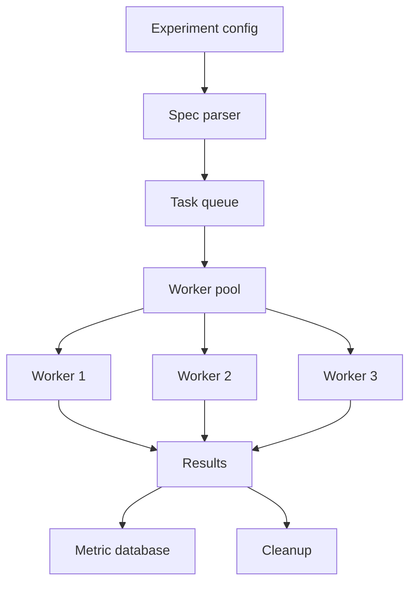

# 실험 러너

> 연구는 실험 사이클을 실행하는 것으로 구성됩니다: 가설을 세우고, 실험을 설계하고, 실행하고, 결과를 평가하고, 반복합니다. 실험 러너는 이 사이클을 자동화합니다. YAML/JSON 설정에서 실험 사양(모델, 하이퍼파라미터, 데이터셋, 평가 작업)을 읽고, 일괄 실험을 위한 작업 큐를 생성 및 관리하고, 워커로 작업을 실행하고, 결과를 일관된 키-값 형식으로 수집하고, 결과를 메트릭 데이터베이스에 저장합니다. 이 레슨은 실험 사양 파서, 작업 큐 관리자, 작업 실행자 및 실험 메트릭 수집기를 구축합니다.

**Type:** Build
**Languages:** Python
**Prerequisites:** Phase 19 lessons 30-37
**Time:** ~90 minutes

## Learning Objectives

- YAML/JSON 설정에서 실험 사양을 읽고 파싱합니다.
- 실행할 각각의 고유한 설정 조합에 대해 작업 항목을 생성하는 작업 큐를 생성합니다.
- 작업 큐에서 작업을 실행하고, stdout/stderr를 파일로 리디렉션하고, 종료 코드를 캡처하는 워커 폴을 구현합니다.
- 실행이 끝나면 결과를 수집하고 메트릭 데이터베이스(예: SQLite)에 저장합니다.

## The Problem

연구는 여러 실험을 실행하는 것으로 구성됩니다: 하이퍼파라미터 스윕, 아키텍처 비교, 데이터셋 변형. 각 실험은 고유한 설정 조합(모델 크기, 학습률, 데이터셋)을 나타냅니다. 실험을 수동으로 실행하면 연구자의 시간이 낭비되고 오류가 발생합니다.

실험 러너는 이 문제를 해결합니다: 설정 파일에서 실험 사양을 읽고, 실행할 각 고유한 설정 조합에 대한 작업 항목을 생성하고, 작업 큐를 관리하고, 워커로 작업을 실행하고, 결과를 수집합니다.

## The Concept



### Experiment spec

실험 설정은 YAML 또는 JSON 파일입니다. 여기에는 다음이 포함됩니다:

- `model` - 실험할 모델(들)
- `hyperparameters` - 스윕할 하이퍼파라미터(학습률, 배치 크기 등)
- `dataset` - 사용할 데이터셋(들)
- `eval_tasks` - 평가할 작업 제품군
- `seeds` - 각 설정에 대해 실행할 시드 수

### Task queue

작업 큐는 파싱된 설정에서 생성됩니다. 각 작업은 파싱된 설정의 기술적으로 가능한 조합을 나타냅니다: 모델 A, 하이퍼파라미터 B, 데이터셋 C, 평가 작업 D, 시드 E. 작업 큐는 작업 ID, 설정 해시 및 상태(대기 중, 실행 중, 완료됨, 실패함)로 각 작업을 추적합니다.

### Worker pool

워커 폴은 작업 큐에서 작업을 실행합니다. 각 워커는 작업을 가져오고, 실행 스크립트(`train.py` 또는 `eval.py` 등)를 호출하고, stdout/stderr를 작업별 로그 파일로 리디렉션하고, 종료 코드를 캡처합니다. 워커 폴은 동시 작업 수를 `--max-workers`로 제한합니다.

### Results collector

실행이 끝나면 결과 수집기가 stdout/stderr 파일을 읽고 메트릭을 추출합니다(정규식으로). 메트릭은 나중에 쿼리 및 분석하기 위해 메트릭 데이터베이스(SQLite)에 저장됩니다.

## Build It

`code/main.py` implements:

- `ExperimentConfig` - YAML/JSON 설정 파일을 읽고 파싱합니다. 모델, 하이퍼파라미터, 데이터셋, 평가 작업 및 시드를 포함합니다.
- `TaskQueue` - 파싱된 설정에서 작업 항목을 생성합니다. 각 작업은 고유한 설정 조합을 나타냅니다.
- `WorkerPool` - 작업 큐에서 작업을 실행하는 워커를 관리합니다.
- `ResultsCollector` - stdout/stderr에서 메트릭을 추출하고 메트릭 데이터베이스(SQLite)에 저장합니다.
- `RunSummary` - 완료된 실행을 요약하고 실패를 강조 표시합니다.

파일 하단의 데모는 실험 설정을 파싱하고, 작업 큐를 생성하고, 워커 폴로 작업을 실행하고, 결과를 수집하고, 요약을 출력합니다.

Run it:

```bash
python3 code/main.py
```

스크립트는 0으로 종료되고 실험 요약(완료된 작업 수, 실패한 작업 수 및 메트릭)을 출력합니다.

## Production Patterns

세 가지 패턴이 이 레슨을 프로덕션 실험 인프라로 확장합니다.

**Task hashing for deduplication.** 각 작업은 설정 해시로 식별됩니다. 동일한 설정의 두 번째 실행은 첫 번째 결과를 재사용합니다. 해싱은 중복을 방지하고, 스윕의 일부를 다시 실행해도 이전 실행이 무효화되지 않으므로 스윕을 재개할 수 있게 합니다.

**Retry logic for transient failures.** 워커 실패(예: OOM, 시간 초과)는 일시적입니다. 워커 폴은 각 작업에 재시도 횟수를 할당해야 합니다. 재시도가 모두 소진되면 작업이 실패로 표시됩니다.

**Checkpointing for long-running experiments.** 실험이 여러 시간이 걸리는 경우, 작업 큐는 중간에 체크포인트되어야 합니다. 크래시 후 러너는 체크포인트에서 재개할 수 있습니다.

## Use It

프로덕션 패턴:

- **Human in the loop for experiment selection.** 모든 설정 조합을 실행할 필요는 없습니다. 사람이 루프에서 스윕의 일부를 선택하고, 무작위 샘플링이 작업 큐의 크기를 제어합니다.
- **Results are version-controlled.** 실험 결과는 git 저장소에 메트릭 데이터베이스로 저장됩니다. 각 커밋은 완료된 실험 스윕을 나타냅니다. 실험의 재현성은 git에 의해 보장됩니다.
- **Dashboard auto-updates.** 메트릭 데이터베이스가 업데이트되면 연구 팀의 대시보드가 자동으로 업데이트됩니다. 대시보드는 최상의 설정, 최신 실험 및 실패한 작업을 보여줍니다.

## Ship It

`outputs/skill-experiment-runner.md`는 실제 프로젝트에서 설정 파일이 저장되는 위치, 로그가 저장되는 위치, 메트릭 데이터베이스가 저장되는 위치 및 실험이 CI에서 실행되는 방식을 설명합니다. 이 레슨은 엔진을 제공합니다.

## Exercises

1. 작업별 stdout/stderr 로그 파일을 별도 파일로 저장하는 `--log-dir` 플래그를 추가합니다.
2. 실패한 작업에 대한 재시도 논리를 추가합니다: 재시도 횟수와 재시도 사이의 지연(초)을 지정하는 `--retry-delay` 플래그.
3. 작업 큐를 주기적으로 체크포인트하는 `--checkpoint-interval` 플래그를 추가합니다. 체크포인트는 나중에 재개할 수 있습니다.
4. 각 실행 후 메트릭 데이터베이스에서 최상의 설정을 쿼리하는 `--best-config` 플래그를 추가합니다.
5. 실험이 완료되면 대시보드를 업데이트하는 `--dashboard-url` 플래그를 추가합니다.

## Key Terms

| Term | What people say | What it actually means |
|------|-----------------|------------------------|
| Experiment spec | "Config file" | 실험할 내용을 설명하는 YAML/JSON 파일 |
| Task queue | "Job list" | 세 가지 상태(대기 중, 실행 중, 완료됨) 중 하나의 고유한 설정 조합을 나타내는 작업 목록 |
| Worker pool | "Executor pool" | 작업 큐에서 작업을 실행하는 병렬 워커 집합 |
| Metric database | "Results DB" | 분석을 위해 정규화된 메트릭을 저장하는 SQLite 데이터베이스 |
| Task hash | "Fingerprint" | 작업의 설정 해시; 중복 실행을 감지하는 데 사용됨 |

## Further Reading

- [SQLite documentation](https://www.sqlite.org/docs.html) - 메트릭 저장을 위한 내장형 데이터베이스
- [HJSON specification](https://hjson.github.io/) - 주석이 있는 JSON의 대안
- [Hydra configuration framework documentation](https://hydra.cc/docs/intro/) - 구성 관리 및 실험 설정의 대안
- Phase 19 · 50 - 가설 생성기, 실험 러너가 실행할 가설 생성
- Phase 19 · 49 - LM 평가 하네스, 실험의 메트릭 계산
- Phase 19 · 53 - 결과 평가자, 실험 메트릭과 가설 비교
