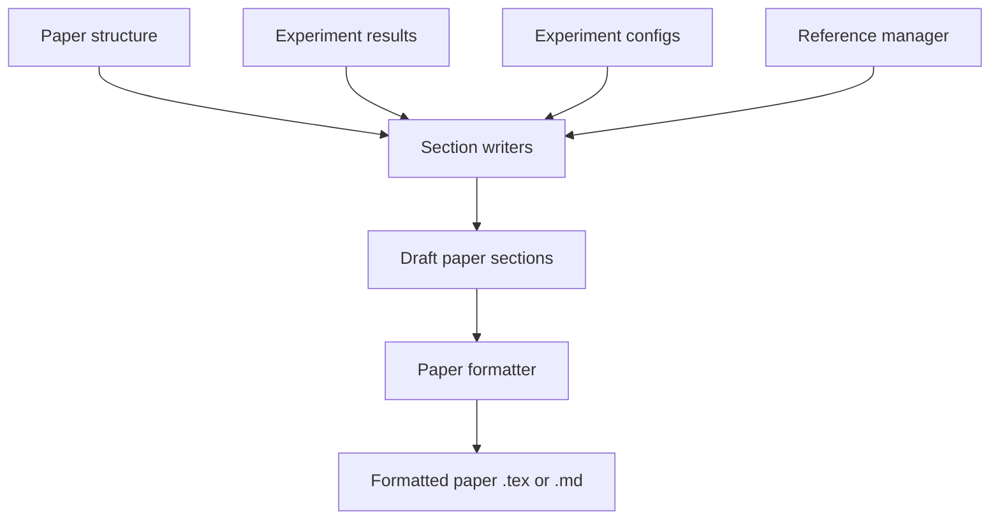

# 논문 작성기

> 연구는 출판으로 완료됩니다. 논문은 발견을 전달하고, 연구를 맥락화하며, 작업을 방어합니다. 논문 작성기는 출판 가능한 형식으로 논문의 초안을 작성함으로써 이 프로세스를 자동화합니다. 논문 구조(섹션, 하위 섹션)를 읽고, 그래프, 표 및 인용을 포함하여 실험 설정 및 결과로 섹션을 채우고, 표준 논문 형식(arXiv, NeurIPS, ACL)으로 초안을 출력합니다. 이 레슨은 구조 정의, 섹션 작성자, 참고 문헌 관리자 및 형식화된 논문 출력을 구축합니다.

**Type:** Build
**Languages:** Python
**Prerequisites:** Phase 19 lessons 30-37
**Time:** ~90 minutes

## Learning Objectives

- 일반 논문 구조(섹션, 하위 섹션)를 정의하고 실험 설정 및 결과로 채웁니다.
- 그래프, 표 및 인용을 포함한 표준 논문 섹션(초록, 서론, 방법, 결과, 결론)을 구현합니다.
- 실험 결과를 텍스트, 표 및 그래프로 요약하는 섹션을 생성합니다.
- 논문을 arXiv, NeurIPS, ACL 형식으로 출력합니다.

## The Problem

연구가 완료되면 논문 초안을 작성하는 데 시간이 많이 걸립니다. 연구자는 실험을 설명하고, 결과에 대해 논문하고, 참고 문헌을 편집합니다. 논문 작성기는 이 프로세스를 자동화합니다: 실험 설정 및 결과로 구조화된 논문 템플릿을 채우고, 표준 논문 형식으로 초안을 출력합니다.

## The Concept



### Paper structure

논문 작성기는 사용자 정의 가능한 구조로 논문의 초안을 작성합니다. 논문 구조는 섹션과 하위 섹션의 계층 구조입니다. 내장 구조는 arXiv 표준(초록, 서론, 방법, 결과, 토론, 결론)을 따릅니다.

### Section writers

각 섹션 유형에는 전용 작성자가 있습니다:

- AbstractWriter - 중요한 결과를 요약하고, 맥락을 제공하고, 기여를 설명합니다.
- IntroductionWriter - 연구 영역을 설명하고, 격차를 식별하고, 논문이 격차를 해소하는 방법을 설명합니다.
- MethodWriter - 실험 설정(모델, 하이퍼파라미터, 데이터셋, 평가 작업)을 설명합니다.
- ResultsWriter - 주요 결과를 요약하고, 가장 중요한 메트릭과 추세에 중점을 둡니다. 그래프와 표 생성을 포함합니다.
- DiscussionWriter - 결과를 해석하고, 한계에 대해 논문하고, 향후 작업을 제안합니다.
- ConclusionWriter - 기여를 요약하고, 더 넓은 영향을 논의합니다.

### Reference manager

참고 문헌 관리자는 BibTeX 파일에서 참고 문헌을 읽고 관리합니다. 각 참고 문헌 항목은 고유한 인용 키로 식별됩니다. 참고 문헌 관리자는 논문 전체에서 인용이 일관되게 사용되도록 보장합니다: 각 인용 키는 정확히 한 번 정의되고 한 번 이상 인용됩니다.

### Paper formatter

형식화기는 초안 섹션을 가져와서 선택한 형식으로 형식화된 논문으로 컴파일합니다. 형식화기는 LaTeX(arXiv, NeurIPS용) 및 마크다운(ACL, 일반용)을 지원합니다. 각각의 형식화기는 논문의 최종 출력 형식을 생성합니다.

## Build It

`code/main.py` implements:

- `PaperStructure` - 섹션과 하위 섹션의 계층을 정의합니다.
- `SectionWriters` - 각 표준 섹션(초록, 서론, 방법, 결과, 결론)을 위한 특수 작성자.
- `ReferenceManager` - BibTeX 파일에서 참고 문헌을 읽고 인용의 일관성을 보장합니다.
- `PaperFormatter` - 초안 섹션을 LaTeX 또는 마크다운으로 형식화합니다.

파일 하단의 데모는 논문 구조를 정의하고, 실험 설정 및 결과를 읽고, 섹션을 작성하고, BibTeX 파일을 읽고, 논문을 arXiv(LaTeX) 및 마크다운 형식으로 출력합니다.

Run it:

```bash
python3 code/main.py
```

스크립트는 0으로 종료되고 생성된 논문 파일의 경로를 출력합니다.

## Production Patterns

세 가지 패턴이 논문 작성기를 프로덕션 연구 도구로 확장합니다.

**Section-level edit tracking.** 논문 작성기는 각 섹션에 대한 편집 히스토리를 추적해야 합니다. 연구자는 이전 버전으로 롤백하거나 특정 섹션 다시 생성을 트리거할 수 있습니다.

**Graph generation from metric DB.** 실험 메트릭은 시각화되어야 합니다. 논문 작성기는 메트릭 데이터베이스를 직접 읽고, matplotlib/plotly로 그래프를 생성하고, 논문에 삽입합니다. 연구자는 그래프 유형(선 그래프, 막대 그래프 등)을 제어할 수 있습니다.

**Human-in-the-loop writing.** 논문 작성기는 완전 자동이 아닙니다. 연구자는 각 섹션을 검토하고, 편집하고, 재생성을 트리거합니다. 섹션은 작성기로 첫 초안이 생성되면 연구자에게 전달됩니다.

## Use It

프로덕션 패턴:

- **Version control for paper drafts.** 논문 초안은 git 저장소에 저장됩니다. 각 커밋은 새 버전의 초안을 나타냅니다. 연구자들은 시간이 지남에 따라 논문이 어떻게 진화했는지 검토할 수 있습니다.
- **Paper inherits project config.** 논문 설정은 프로젝트 설정을 상속합니다. 실험 설정이 변경되면 논문 작성기가 논문 방법 섹션을 업데이트합니다.
- **Citation completeness check.** 논문 작성기는 모든 인용 키가 BibTeX 파일에 정의되어 있는지 확인합니다. 누락된 참고 문헌은 빌드 시간에 보고됩니다.

## Ship It

`outputs/skill-paper-writer.md`는 실제 프로젝트에서 사용되는 논문 구조, 논문이 저장되는 형식 및 연구자가 논문 초안을 검토하는 방법을 설명합니다. 이 레슨은 엔진을 제공합니다.

## Exercises

1. 논문의 graphviz를 사용하여 실험 파이프라인을 설명하는 다이어그램 생성을 추가합니다.
2. 논문의 matplotlib를 사용하여 메트릭 데이터베이스에서 그래프를 생성하는 그래프 생성을 추가합니다.
3. LaTeX 출력을 위한 BibTeX 참고 문헌 파일 생성을 추가합니다.
4. 마크다운 출력을 위한 논문 워드 카운트 추정을 추가합니다.
5. 논문에 사용된 모든 인용 키가 BibTeX 파일에 정의되어 있는지 확인하는 `--citation-completeness` 플래그를 추가합니다.

## Key Terms

| Term | What people say | What it actually means |
|------|-----------------|------------------------|
| Paper structure | "Section outline" | 논문 섹션의 계층 구조 |
| Section writer | "Draft section" | 논문의 단일 섹션에 대한 텍스트를 생성하는 특수 작성기 |
| Reference manager | "Citation manager" | BibTeX 항목 읽기 및 인용 일관성 확인 |
| Paper formatter | "Format converter" | 초안 섹션을 LaTeX, 마크다운 등으로 형식화 |
| Draft | "First version" | 검토를 위해 생성된 논문의 초기 버전 |

## Further Reading

- [arXiv submission guidelines](https://arxiv.org/help/submit) - LaTeX를 사용한 arXiv 제출 형식
- [NeurIPS paper format](https://neurips.cc/Conferences/2025/PaperInformation/StyleFiles) - NeurIPS 제출 형식
- [ACL paper format](https://acl-org.github.io/ACLPUB/format.html) - ACL 제출 형식
- [matplotlib documentation](https://matplotlib.org/stable/contents.html) - 실험 그래프 생성
- Phase 19 · 52 - 실험 러너, 논문 작성기가 그래프를 생성하는 메트릭 데이터베이스
- Phase 19 · 53 - 결과 평가자, 논문 작성기가 논문에 가설을 통합하는 위치
- Phase 19 · 55 - 크리틱 루프, 논문 초안을 개선하기 위한 반복적 피드백
