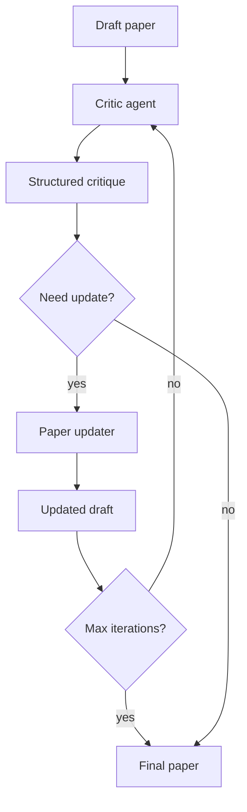

# 크리틱 루프

> 연구의 두 번째 드래프트는 첫 번째 드래프트보다 낫습니다. 크리틱 루프는 논문 초안에 대한 피드백(비평)을 생성하고, 해당 피드백에 따라 초안을 업데이트하고, 반복합니다. 이 레슨은 초안을 읽고, 논리적 격차, 불명확한 주장, 지원되지 않는 진술, 형식 오류를 식별하고, 구조화된 비평을 생성하는 크리틱을 구현합니다. 크리틱의 피드백은 초안을 업데이트하는 데 사용됩니다. 이 루프는 최대 반복 횟수 후에 종료됩니다.

**Type:** Build
**Languages:** Python
**Prerequisites:** Phase 19 lessons 30-37
**Time:** ~90 minutes

## Learning Objectives

- LLM을 사용하여 텍스트의 논문 초안을 읽고, 논리적 격차, 불명확한 주장, 지원되지 않는 주장, 형식 오류를 식별하는 Critic 에이전트를 구현합니다.
- 초안 업데이트를 위한 구조화된 비평(격차 유형, 위치, 심각도, 제안된 수정)을 생성합니다.
- 비평에 따라 논문 초안을 업데이트하는 논문 업데이터를 구현합니다.
- 최대 반복 횟수 후에 비평 루프를 종료합니다.

## The Problem

논문의 첫 번째 초안은 불완전합니다. 편향되고, 격차가 있으며, 형식 오류가 포함되어 있습니다. 두 번째 초안은 일반적으로 더 낫습니다. 세 번째는 더 낫습니다. 그러나 논문을 여러 번 개정하는 것은 시간이 많이 걸립니다. 자동 비평 루프는 각 반복에서 초안을 업데이트하는 데 사용되는 피드백(비평)을 생성함으로써 이 프로세스의 속도를 높입니다.

## The Concept



### Critic agent

크리틱 에이전트는 논문 초안을 읽고 구조화된 피드백(비평)을 생성합니다. 피드백에는 초안의 격차가 포함됩니다:

- 논리적 격차 - 주장이 전제에서 결론까지 따라가지 못함
- 불명확한 주장 - 주장의 의미를 파악할 수 없음
- 지원되지 않는 주장 - 증거 없이 주장이 이루어짐
- 형식 오류 - 참고 문헌 누락, 잘못된 LaTeX, 구조 불일치

### Structured critique

각 비평 항목에는 다음 필드가 있습니다:

- `type` - 격차 유형(논리적 격차, 불명확한 주장, 지원되지 않는 주장, 형식 오류)
- `location` - 격차가 발생한 초안의 위치(섹션, 단락)
- `severity` - 격차의 심각도(높음, 중간, 낮음)
- `suggested_fix` - 격차를 해결하는 방법에 대한 제안

### Paper updater

논문 업데이터는 비평을 읽고 초안을 업데이트합니다. 비평의 각 항목에 대해 업데이터는 초안의 관련 섹션을 수정합니다. 업데이터는 동일한 크리틱 에이전트에 의해 구동되는 LLM을 사용합니다. 크리틱 에이전트는 구멍을 식별합니다. 업데이터는 초안을 수정합니다.

### Termination condition

비평 루프는 다음과 같은 경우 종료됩니다:

- 비평에 항목이 없음(초안이 완벽함)
- 최대 반복 횟수(예: 5)에 도달함

## Build It

`code/main.py` implements:

- `CriticAgent` - LLM을 사용하여 논문 초안을 읽고 구조화된 비평을 생성합니다. 비평에는 격차 유형, 위치, 심각도 및 제안된 수정이 포함됩니다.
- `PaperUpdater` - 비평을 읽고 초안을 업데이트합니다.
- `CritiqueLoop` - 비평 루프의 메인 루프: 반복하고, 비평을 생성하고, 초안을 업데이트하고, 종료 조건을 확인합니다.
- `CritiqueStats` - 각 반복에 대한 통계를 추적합니다: 격차 수, 평균 심각도, 추세.

파일 하단의 데모는 장난감 논문 초안으로 시작하고, 크리틱 루프를 실행하고, 업데이트된 초안과 통계를 출력합니다.

Run it:

```bash
python3 code/main.py
```

스크립트는 0으로 종료되고 반복당 격차 수를 보여주는 요약 통계와 함께 최종 논문을 출력합니다.

## Production Patterns

세 가지 패턴이 크리틱 루프를 생산적 검토자로 확장합니다.

**Critic threshold for each iteration.** 각 반복에서 크리틱 에이전트는 최소 심각도 임계값의 격차만 보고해야 합니다. 첫 번째 반복에서 임계값은 "높음"입니다. 후속 반복에서 임계값이 "낮음"으로 낮아집니다. 이는 높은 심각도의 문제를 먼저 잡아내고, 낮은 심각도의 폴리싱은 나중에 수행합니다.

**Human in the loop for critical critiques.** 생성된 비평 중 하나라도 "인간 검토 필요" 태그가 있으면 비평 루프가 일시 중지되고 인간 검토자가 피드백을 제공합니다. 인간 검토자는 비평을 승인, 거부 또는 수정할 수 있습니다. 이는 높은 영향력이 있는 격차가 자동으로 간과되지 않도록 보장합니다.

**Critique history for transparency.** 각 반복의 비평 기록은 저장됩니다. 연구자는 각 반복에서 식별된 격차와 초안이 시간이 지남에 따라 어떻게 개선되었는지 검토할 수 있습니다. 비평 기록은 또한 미래 개선을 위한 맥락을 제공합니다.

## Use It

프로덕션 패턴:

- **Critique-cache for repeated drafts.** 동일한 논문이 여러 번 비평되는 경우, 비평은 캐시되어야 합니다. 캐시는 초안 해시에 의해 키가 지정됩니다. 동일한 초안의 후속 크리틱은 캐시된 비평을 재사용합니다.
- **Draft versioning for checkpointing.** 각 반복 후에 초안 버전이 저장됩니다. 연구자는 이전 초안으로 롤백할 수 있습니다. 버전 관리는 git에 의해 처리됩니다.
- **Human approval threshold for critical updates.** 심각도가 "높음"인 업데이트는 인간의 승인이 필요합니다. 인간 검토자가 업데이트를 승인하거나 거부합니다.

## Ship It

`outputs/skill-critic-loop.md`는 실제 프로젝트에서 비평 루프가 각 반복에서 사용하는 모델, 비평이 캐시되는 방법 및 인간 검토가 필요한 시점을 설명합니다. 이 레슨은 엔진을 제공합니다.

## Exercises

1. 각 반복에 대해 비평 심각도 임계값이 감소하는 `--severity-threshold` 플래그를 추가합니다.
2. 비평 항목에 대한 인간 검토를 위한 대화형 모드를 추가합니다. `--interactive` 플래그는 각 비평 라운드 후에 일시 중지하고 인간 검토자가 비평을 승인, 거부 또는 수정하도록 허용합니다.
3. 각 반복 후에 초안 버전을 저장하는 `--save-drafts` 플래그를 추가합니다.
4. 각 반복의 비평 개수와 심각도 추세를 플롯하는 `--plot-trends` 플래그를 추가합니다.
5. 주어진 격차 유형의 비평만 생성되도록 크리틱 에이전트를 제한하는 `--focus` 플래그(예: `--focus logic`)를 추가합니다.

## Key Terms

| Term | What people say | What it actually means |
|------|-----------------|------------------------|
| Critic agent | "Reviewer" | 초안을 읽고 구조화된 피드백을 생성하는 LLM 기반 에이전트 |
| Critique | "Feedback" | 정해진 수의 격차를 포함한 구조화된 피드백 목록 |
| Paper updater | "Reviser" | 비평에 따라 초안을 업데이트하는 LLM 기반 에이전트 |
| Termination condition | "Stop rule" | 루프가 중지되는 시점: 비평 없음, 최대 반복 횟수 또는 인간 개입 |
| Critique history | "Review log" | 각 반복에서 생성된 모든 비평 기록 |

## Further Reading

- [Miao et al., Self-Refine: Iterative Refinement with Self-Feedback (arXiv 2303.17651)](https://arxiv.org/abs/2303.17651) - 크리틱 루프의 기반이 되는 피드백-개선 패러다임
- [Scheurer et al., Self-Correction in AI Systems (arXiv 2310.01714)](https://arxiv.org/abs/2310.01714) - AI 시스템에서 자기 수정의 한계와 가능성
- [Du et al., Improving Factuality and Reasoning in Language Models through Multiagent Debate (arXiv 2305.14325)](https://arxiv.org/abs/2305.14325) - 여러 크리틱 에이전트가 토론하는 다중 에이전트 변형
- Phase 19 · 54 - 논문 작성기, 이 크리틱 루프가 개선하는 초안 생성
- Phase 19 · 56 - 반복 스케줄러, 크리틱 루프가 어떻게 더 큰 연구 사이클에 들어맞는지
