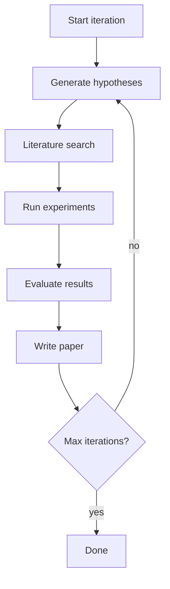

# 반복 스케줄러

> 연구는 개별 실험에 관한 것이 아니라 실험 사이클을 조정하는 것에 관한 것입니다. 반복 스케줄러는 가설 생성, 문헌 검색, 실험 실행, 결과 평가 및 논문 작성을 포함한 반복 연구 사이클을 관리합니다. 이 레슨은 연구 파이프라인의 단계를 정의하고, 단계를 순서대로 실행하고, 데이터베이스에 진행 상황을 기록하는 스케줄러를 구축합니다.

**Type:** Build
**Languages:** Python
**Prerequisites:** Phase 19 lessons 30-37
**Time:** ~90 minutes

## Learning Objectives

- 연구 파이프라인을 위한 단계 목록(가설 생성, 문헌 검색, 실험 실행, 결과 평가, 논문 작성)을 정의합니다.
- 각 단계의 상태(보류 중, 실행 중, 완료, 실패)를 추적하는 스케줄러를 구현합니다.
- 단계를 순서대로 실행하고 오류를 관리합니다(단계 실패 시 중지 또는 계속).
- 데이터베이스(SQLite)에 진행 상황을 기록하고 스케줄러가 crash에서 재개되도록 합니다.

## The Problem

연구는 반복적인 프로세스입니다. 사이클의 각 반복은 여러 단계를 포함합니다: 가설 생성, 문헌 검색, 실험 실행, 결과 평가, 논문 작성. 반복 스케줄러는 사이클을 조정합니다. 단계를 순서대로 실행하고, 상태를 추적하고, 오류를 관리합니다.

## The Concept



### Stage definition

각 반복 스케줄러 단계는 클래스로 정의됩니다:

- `HypothesisGeneration` - Phase 19 레슨 50의 가설 생성기를 실행합니다.
- `LiteratureSearch` - Phase 19 레슨 51의 문헌 검색 에이전트를 실행합니다.
- `ExperimentRunner` - Phase 19 레슨 52의 실험 러너를 실행합니다.
- `ResultEvaluator` - Phase 19 레슨 53의 결과 평가자를 실행합니다.
- `PaperWriter` - Phase 19 레슨 54의 논문 작성기를 실행합니다.

### State tracking

스케줄러는 데이터베이스(SQLite)의 각 반복 및 단계에 대한 진행 상황을 추적합니다. 각 레코드에는 반복 ID, 단계 이름, 시작 시간, 종료 시간 및 상태(보류 중, 실행 중, 완료, 실패)가 포함됩니다. 상태는 각 단계 후에 업데이트됩니다. crash가 발생하면 스케줄러는 데이터베이스에서 재개할 수 있습니다.

### Error management

단계가 실패하면 스케줄러는 실패한 단계를 기록하고 실패를 처리하는 방법에 대한 구성 가능한 정책을 가지고 있습니다: 실패 시 중지(기본값), 실패 시 계속, 또는 지정된 횟수만큼 재시도.

### Logging

스케줄러는 각 단계의 stdout과 stderr를 캡처하여 반복별 로그 파일에 기록합니다. 로그 파일은 데이터베이스에 경로로 저장됩니다. 로그는 스케줄러가 각 단계에 대한 출력을 보존하고 연구자가 나중에 검토할 수 있도록 합니다.

## Build It

`code/main.py` implements:

- `IterationStage` - 단계 인터페이스를 정의하는 기본 클래스: `run(iteration_id, config)`는 상태와 로그를 반환합니다.
- `StageRegistry` - ID별로 단계를 등록하고 조회하는 중앙 레지스트리.
- `IterationScheduler` - 반복을 관리하는 메인 스케줄러: 반복을 생성하고, 단계를 실행하고, 상태를 추적하고, 오류를 관리합니다.
- `StateDB` - 반복 및 단계 진행 상황을 추적하는 SQLite 데이터베이스.

파일 하단의 데모는 반복 스케줄러를 정의하고, 단계를 등록하고, 여러 반복을 실행하고, 진행 상황 데이터베이스를 출력합니다.

Run it:

```bash
python3 code/main.py
```

스크립트는 0으로 종료되고 반복당 완료된 단계 상태와 함께 반복 진행 상황을 출력합니다.

## Production Patterns

세 가지 패턴이 반복 스케줄러를 프로덕션 연구 오케스트레이터로 확장합니다.

**Iteration budget.** 반복 수는 최대 반복 횟수에 의해 제한됩니다. 기본값은 10입니다. 연구자는 CLI 플래그로 예산을 변경할 수 있습니다.

**Stage-level caching.** 동일한 단계가 동일한 입력으로 여러 번 실행되는 경우, 단계의 출력이 캐시되어야 합니다. 캐싱은 동일한 가설이 여러 번 생성되는 것을 방지합니다.

**Parallel stage execution.** 일부 단계는 병렬로 실행될 수 있습니다(예: 문헌 검색은 실험 실행과 동시에 실행 가능). 스케줄러는 병렬 및 순차 실행을 모두 지원합니다.

## Use It

프로덕션 패턴:

- **Human in the loop for iteration start.** 각 반복은 사람의 승인으로 시작됩니다. 연구자는 스케줄러가 다음 반복을 시작하기 전에 현재 반복의 결과를 검토합니다.
- **Iteration artifact archival.** 각 반복의 아티팩트(가설, 문헌, 실험 메트릭, 논문 초안)는 보관됩니다. 연구자는 완료된 반복을 검토하고 이전 반복으로 롤백할 수 있습니다.
- **CI integration.** 반복 스케줄러는 CI/CD 시스템에 통합될 수 있습니다. 스케줄러는 CI에 의해 트리거되고, 반복 상태는 CI 빌드 상태로 보고됩니다.

## Ship It

`outputs/skill-iteration-scheduler.md`는 실제 프로젝트에서 사용되는 최대 반복 횟수, 단계가 순서대로 실행되는지 병렬로 실행되는지, 데이터베이스가 저장되는 위치 및 반복이 사람의 승인으로 시작되는 방법을 설명합니다. 이 레슨은 엔진을 제공합니다.

## Exercises

1. 단계 수준 캐싱을 추가합니다: 각 단계의 입력 해시를 계산하고 이전 출력이 캐시되었는지 확인합니다.
2. 병렬 단계 실행을 추가합니다: `--parallel-stages` 플래그가 동시에 실행할 단계를 지정합니다.
3. 각 반복 후에 연구자가 결과를 검토하기 위해 일시 중지하는 대화형 모드를 추가합니다. `--interactive` 플래그는 연구자가 다음 반복을 승인할 때까지 일시 중지합니다.
4. 각 반복의 완료된 단계와 그 상태를 시각화하는 DAG(방향성 비순환 그래프)를 플롯하는 `--plot-dag` 플래그를 추가합니다.
5. 완료된 반복의 모든 아티팩트를 단일 보관 파일로 패키징하는 `--archive-iterations` 플래그를 추가합니다.

## Key Terms

| Term | What people say | What it actually means |
|------|-----------------|------------------------|
| Iteration | "Cycle" | 가설, 검색, 실험, 평가, 글쓰기의 하나의 전체 사이클 |
| Stage | "Phase" | Iteration의 단일 단계: 가설 생성, 문헌 검색 등 |
| State tracking | "Progress DB" | 각 반복/단계의 상태를 저장하는 SQLite 데이터베이스 |
| Stage registry | "Phase lookup" | ID로 단계를 등록하고 조회하는 레지스트리 |
| Iteration budget | "Max iters" | 실행할 최대 반복 횟수 |

## Further Reading

- [Prefect workflow orchestration](https://docs.prefect.io/) - 연구 이외 영역을 위한 스케줄러 디자인 패턴
- [Airflow DAG documentation](https://airflow.apache.org/docs/apache-airflow/stable/core-concepts/dags.html) - DAG 기반 오케스트레이션
- [SQLAlchemy ORM](https://docs.sqlalchemy.org/en/20/) - 데이터베이스 관리를 위한 ORM 대안
- Phase 19 · 50 - 가설 생성기, 반복의 첫 번째 단계
- Phase 19 · 51 - 문헌 검색 에이전트, 반복의 두 번째 단계
- Phase 19 · 52 - 실험 러너, 반복의 세 번째 단계
- Phase 19 · 53 - 결과 평가자, 반복의 네 번째 단계
- Phase 19 · 54 - 논문 작성기, 반복의 다섯 번째 단계
- Phase 19 · 55 - 크리틱 루프, 반복의 여섯 번째 단계(선택 사항)
- Phase 19 · 57 - 엔드-투-엔드 연구 데모, 스케줄러를 완전한 파이프라인으로 통합
