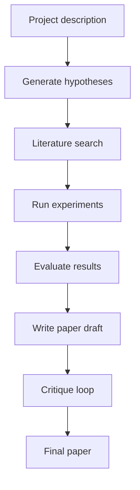

# 엔드-투-엔드 연구 데모

> 연구 파이프라인은 가설에서 논문까지 연결됩니다. 엔드-투-엔드 연구 데모는 이전 7개 레슨(레슨 50-56)의 모든 구성 요소를 시연하는 통합 스크립트이며, 프로젝트 설명을 읽고, 가설을 생성하고, 문헌을 검색하고, 실험을 실행하고, 결과를 평가하고, 논문을 작성합니다. 이 레슨은 통합 스크립트를 실행하고, 각 단계의 출력이 다음 단계로 올바르게 전달되는지 확인합니다.

**Type:** Build
**Languages:** Python
**Prerequisites:** Phase 19 lessons 50-56
**Time:** ~90 minutes

## Learning Objectives

- 7개의 이전 레슨을 통합하는 통합 스크립트를 실행합니다.
- 각 단계의 출력이 올바른 형식으로 되어 있고 다음 단계에 필요한 모든 정보를 포함하는지 확인합니다.
- 데모 프로젝트 설명으로 스크립트를 실행하고 엔드-투-엔드 출력을 생성합니다.

## The Problem

가설 생성, 문헌 검색, 실험 러너, 결과 평가자, 논문 작성기 및 크리틱 루프는 별도의 레슨입니다. 그들은 조정되지 않았습니다. 엔드-투-엔드 연구 데모는 이들을 통합하여 연구 파이프라인을 형성합니다.

## The Concept

파이프라인은 프로젝트 설명을 읽는 것으로 시작됩니다. 설명은 Phase 19 레슨 50(가설 생성기)으로 전달되어 가설을 생성합니다. 가설은 Phase 19 레슨 51(문헌 검색 에이전트)로 전달되어 관련 문헌을 검색합니다. 가설과 검색 결과는 Phase 19 레슨 52(실험 러너)로 전달되어 실험을 실행합니다. 실험 메트릭은 Phase 19 레슨 53(결과 평가자)로 전달되어 가설을 평가합니다. 가설 평가는 Phase 19 레슨 54(논문 작성기)로 전달되어 논문을 생성합니다. 논문 초안은 Phase 19 레슨 55(크리틱 루프)로 전달되어 개선됩니다. 마지막 논문이 출력됩니다.



## Build It

`code/main.py` implements:

- `ResearchPipeline` - 모든 단계를 단일 메서드 `run(description)`에 연결하는 메인 파이프라인 클래스.
- `PipelineStep` - 각 단계에 대한 래퍼 클래스로 필요한 입력/출력 인터페이스를 강제합니다.
- `PipelineValidator` - 각 단계의 출력이 올바른 형식(JSON 스키마)이고 모든 필수 필드를 포함하는지 확인합니다.
- `EndToEndDemo` - 데모 프로젝트 설명으로 파이프라인을 실행하고 각 단계의 출력을 표시하는 메인 스크립트.

파일 하단의 데모는 파이프라인을 실행하고, 각 단계의 출력을 표시하고, 형식을 검증하고, 최종 논문을 출력합니다.

Run it:

```bash
python3 code/main.py
```

스크립트는 0으로 종료되고 각 단계의 출력 요약과 함께 최종 논문을 출력합니다.

## Production Patterns

세 가지 패턴이 데모를 생산성 연구 인프라로 확장합니다.

**Pipeline configuration.** 파이프라인 설정(사용할 모델, 실험 구성 등)은 YAML 또는 JSON 설정 파일에서 읽어야 합니다. 연구자는 설정 파일을 변경하여 파이프라인의 동작을 수정할 수 있습니다.

**Checkpointing.** 파이프라인은 각 단계 후에 체크포인트되어야 합니다. 체크포인팅을 통해 충돌 후 첫 단계가 아닌 중단된 단계부터 파이프라인을 재개할 수 있습니다.

**Parallel pipeline execution.** 독립적인 단계(예: 가설 생성 및 문헌 검색)는 병렬로 실행되어야 합니다. 종속 단계(예: 실험 러너는 문헌 검색 이후)는 순서대로 실행되어야 합니다.

## Use It

프로덕션 패턴:

- **Human in the loop for pipeline execution.** 파이프라인 실행은 인간의 승인으로 시작됩니다. 연구자는 파이프라인이 시작되기 전에 프로젝트 설명을 제공합니다. 각 단계의 출력은 승인을 위해 연구자에게 표시됩니다.
- **Pipeline artifact archival.** 각 파이프라인 실행의 아티팩트(가설, 문헌, 실험 메트릭, 논문 초안)는 보관됩니다. 연구자는 완료된 파이프라인 실행을 검토하고 이전 실행으로 롤백할 수 있습니다.
- **CI integration.** 엔드-투-엔드 파이프라인은 CI/CD 시스템에 통합될 수 있습니다. 파이프라인은 정기적으로(예: 매주) 실행되어 새로운 가설을 생성합니다.

## Ship It

`outputs/skill-e2e-research-demo.md`는 실제 프로젝트에서 파이프라인이 실행되는 트리거, 각 단계가 사용하는 설정 파일 및 아티팩트가 저장되는 위치를 설명합니다. 이 레슨은 엔진을 제공합니다.

## Exercises

1. 파이프라인 설정을 YAML 또는 JSON 설정 파일로 외부화합니다.
2. 각 단계 후에 체크포인트를 추가합니다. 체크포인트는 충돌 후 파이프라인을 재개할 수 있도록 합니다.
3. 독립적인 단계가 병렬로 실행되는 병렬 단계 실행을 추가합니다.
4. 검증기(Phase 19 레슨 53)가 파이프라인 결과를 평가하도록 통합합니다.
5. 가설과 논문 초안이 업데이트되는 반복 모드를 추가합니다.

## Key Terms

| Term | What people say | What it actually means |
|------|-----------------|------------------------|
| Pipeline | "Research workflow" | 하나의 프로젝트 설명을 입력으로 받아 하나의 논문을 출력하는 연결된 단계 시퀀스 |
| Pipeline step | "Phase wrapper" | 단일 레슨을 래핑하고 입력/출력 인터페이스를 강제하는 클래스 |
| Pipeline configuration | "Config file" | 파이프라인의 동작을 제어하는 YAML/JSON 설정 파일 |
| Checkpointing | "Resume after crash" | 단계가 완료된 후 파이프라인 상태를 저장하는 메커니즘 |
| Artifact archival | "Save outputs" | 각 파이프라인 실행의 출력을 저장하는 보관 시스템 |

## Further Reading

- [Apache Beam](https://beam.apache.org/) - 파이프라인 디자인을 위한 배치 및 스트리밍 데이터 처리 프레임워크
- [Luigi](https://github.com/spotify/luigi) - 장기 실행 워크플로우를 위한 파이프라인 오케스트레이션 프레임워크
- [Kedro](https://kedro.readthedocs.io/en/stable/) - 재현 가능하고 유지보수 가능한 데이터 파이프라인을 위한 프레임워크
- Phase 19 · 50 - 가설 생성기(파이프라인 단계)
- Phase 19 · 51 - 문헌 검색 에이전트(파이프라인 단계)
- Phase 19 · 52 - 실험 러너(파이프라인 단계)
- Phase 19 · 53 - 결과 평가자(파이프라인 단계)
- Phase 19 · 54 - 논문 작성기(파이프라인 단계)
- Phase 19 · 55 - 크리틱 루프(파이프라인 단계)
- Phase 19 · 56 - 반복 스케줄러(파이프라인 단계)
