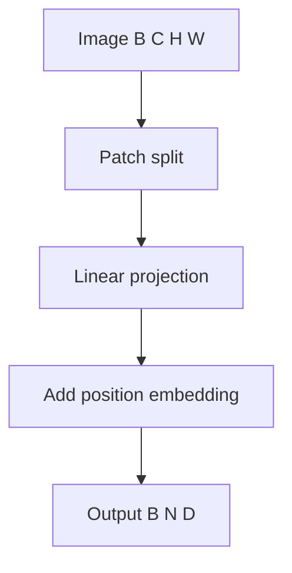

# 비전 인코더: 패치 임베딩

> 언어 모델은 단어를 처리합니다. 비전 모델은 픽셀 그리드를 처리합니다. 언어와 비전 사이의 첫 번째 다리는 패치 임베딩입니다: 입력 이미지를 고정 크기 패치로 분할하고, 각 패치를 선형 투영으로 임베딩하고, 위치 임베딩을 추가하는 레이어입니다. 이 레슨은 ViT의 패치 임베딩 레이어와 호환되는 패치 임베딩 레이어를 구축합니다.

**Type:** Build
**Languages:** Python
**Prerequisites:** Phase 19 lessons 01-10
**Time:** ~60 minutes

## Learning Objectives

- `nn.Conv2d`를 사용하여 고정 크기 패치 입력 이미지를 분할하고 각 패치를 임베딩하는 패치 임베딩 레이어를 구현합니다.
- 학습 가능한 위치 임베딩을 추가하고 배치 차원 전체에서 브로드캐스팅이 올바르게 작동하는지 확인합니다.
- 패치 임베딩 레이어의 순전파가 텐서 형태에 대한 올바른 가정을 가지고 있는지 단위 테스트를 통해 확인합니다.

## The Problem

비전 트랜스포머(ViT)는 이미지를 트랜스포머에 공급하기 위해 토큰 시퀀스로 변환합니다. 이미지가 언어 모델에 입력되기 전에 패치 임베딩 레이어가 입력 이미지(`B, C, H, W`)를 패치 토큰 시퀀스(`B, N, D`)로 변환하며, 여기서 `N = H / P * W / P`(패치 수)이고 `D`는 각 패치의 임베딩 차원입니다. ViT와 언어 모델을 연결할 때, 디코더-전용 언어 모델이 비전 입력을 시퀀스의 첫 번째 토큰으로 처리할 수 있도록 이 패치 임베딩 레이어를 복제해야 합니다.

## The Concept



### Patch split

패치 분할은 이미지를 겹치지 않는 고정 크기 패치로 분할합니다. 이를 위한 두 가지 접근 방식이 있습니다:

1. `nn.Unfold`를 사용한 수동 분할 - 이미지를 평평하게 만듭니다.
2. `nn.Conv2d`를 사용한 합성곱 접근 방식 - 각 패치를 단일 픽셀로 효과적으로 줄입니다.

`nn.Conv2d` 접근 방식이 더 깔끔합니다: `kernel_size=stride=patch_size`인 합성곱 레이어는 `(B, D, H/P, W/P)` 형태의 텐서를 출력합니다. 이를 `(B, D, N)`으로 평평하게 만든 다음 전치하여 `(B, N, D)`로 만듭니다.

### Linear projection

합성곱 자체가 선형 투영입니다. `in_channels=C`, `out_channels=D`인 `Conv2d` 레이어로 가중치 `(D, C, P, P)`를 학습하며, 이는 트랜스포머 차원에 맞게 각 패치를 임베딩합니다.

### Position embedding

위치 임베딩은 학습 가능한 파라미터 `(1 + N, D)`입니다. 첫 번째 위치는 `[CLS]` 토큰(또는 비전-언어 모델의 이미지 시작을 알리는 기타 특수 토큰)을 위한 것입니다. 나머지 `N` 위치는 각 패치를 위한 것입니다. 위치 임베딩은 패치 임베딩 후에 추가됩니다.

## Build It

`code/main.py` implements:

- `PatchEmbedding` - `nn.Conv2d`로 패치 임베딩 레이어를 구현합니다. `img_size`, `patch_size`, `in_channels`, `embed_dim` 파라미터를 받습니다.
- `PositionEmbedding` - 학습 가능한 위치 임베딩을 구현합니다. `num_patches`, `embed_dim`을 받습니다.

파일 하단의 데모는 무작위 이미지 텐서를 합성 패치 임베딩 레이어에 통과시키고 출력 형태를 인쇄합니다.

Run it:

```bash
python3 code/main.py
```

스크립트는 0으로 종료되고 입력 및 출력 텐서 형태를 출력합니다.

## Production Patterns

두 가지 패턴이 이 레슨을 프로덕션 비전 모델로 확장합니다.

**Patch size is a hyperparameter, not a constant.** `patch_size`는 설정 가능해야 합니다. 일반적인 패치 크기는 16(224x224 이미지의 경우 196개 패치) 또는 32(49개 패치)입니다. 더 작은 패치는 해상도를 희생하면서 더 세분화된 정보를 제공합니다. 패치 크기는 변경될 때 모델의 형태가 변경되므로 설정 파일에 속합니다.

**Position embeddings can be interpolated.** 사전 훈련된 모델이 훈련 중에 본 것보다 더 많은 패치(더 큰 이미지)가 제공되면 위치 임베딩을 보간해야 합니다. 보간은 더 큰 위치 임베딩 행렬에 맞게 학습된 위치 임베딩을 확장합니다.

## Use It

프로덕션 패턴:

- **Image preprocessing before patching.** 이미지는 고정된 해상도로 크기가 조정되고 정규화되어야 합니다. 이미지 크기 조정은 `torchvision.transforms.Resize`로 처리됩니다. 정규화는 입력 픽셀을 평균 0, 분산 1로 조정합니다.
- **[CLS] token for classification tasks.** 이미지 분류를 위해 첫 번째 패치 임베딩에 연결된 학습 가능한 `[CLS]` 토큰이 있습니다. `[CLS]` 토큰의 최종 은닉 상태는 분류에 사용됩니다. 다운스트림 모델이 처음에 `[CLS]` 토큰을 기대하지 않는 경우 비전-언어 모델은 이 토큰을 생략해야 합니다.

## Ship It

`outputs/skill-vision-encoder-patches.md`는 실제 프로젝트에서 사용할 패치 크기, 사전 훈련된 가중치가 있는지 여부 및 다운스트림 모델이 이미지 임베딩을 어떻게 사용하는지 설명합니다. 이 레슨은 엔진을 제공합니다.

## Exercises

1. `--patch-size` CLI 플래그를 추가하고 여러 패치 크기(16, 32)에 대한 출력 형태를 비교합니다.
2. 무작위 위치 임베딩이 학습 가능한지 확인하는 단위 테스트를 추가합니다.
3. 합성 이미지가 패치 임베딩 레이어를 통과할 때 형태를 시각화할 수 있는 `--debug-vis` 플래그를 추가합니다.
4. 첫 번째 위치에 `[CLS]` 토큰을 추가합니다: 첫 번째 위치는 학습 가능한 `[CLS]` 임베딩이고 나머지는 패치입니다.
5. 위치 임베딩을 보간하는 기능을 추가하고 더 많은 패치가 있는 더 큰 이미지 텐서에서 기능을 테스트합니다.

## Key Terms

| Term | What people say | What it actually means |
|------|-----------------|------------------------|
| Patch embedding | "Image to tokens" | Conv2d를 사용하여 이미지를 토큰 시퀀스로 변환 |
| Position embedding | "Where in image" | 패치 순서를 인코딩하는 학습 가능한 위치 벡터 |
| Patch size | "Pixel group size" | 겹치지 않는 각 정사각형 이미지 영역의 크기 |

## Further Reading

- [Dosovitskiy et al., An Image is Worth 16x16 Words (arXiv 2010.11929)](https://arxiv.org/abs/2010.11929) - ViT 논문
- [torch.nn.Conv2d documentation](https://pytorch.org/docs/stable/generated/torch.nn.Conv2d.html) - 패치 임베딩의 핵심 연산
- Phase 19 · 59 - ViT 트랜스포머: 이 패치 임베딩 레이어를 완전한 ViT 백본에 연결
- Phase 19 · 60 - 투영 레이어: ViT 출력을 언어 모델 임베딩 차원에 정렬
