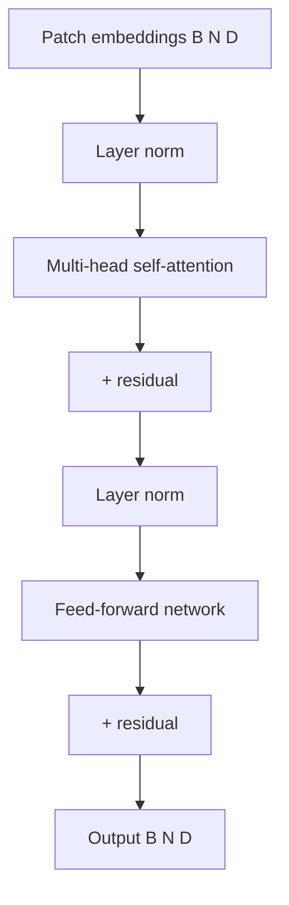

# ViT 트랜스포머

> 비전 트랜스포머(ViT)는 표준 트랜스포머 인코더를 이미지 패치 시퀀스에 적용합니다. 레슨 58은 패치 임베딩을 생성합니다; 이 레슨은 패치 임베딩을 처리하는 트랜스포머 인코더를 구축합니다. 이 레슨의 ViT 인코더는 패치 임베딩을 가져와서 레이어 정규화, 셀프 어텐션 및 피드포워드 네트워크를 통해 처리하고 트랜스포머-인코딩된 시퀀스를 출력합니다.

**Type:** Build
**Languages:** Python
**Prerequisites:** Phase 19 lessons 58, 01-10
**Time:** ~60 minutes

## Learning Objectives

- 레이어 정규화, 멀티-헤드 셀프 어텐션 및 피드포워드 네트워크가 포함된 ViT 트랜스포머 인코더 블록을 구현합니다.
- 인코더 블록을 직렬로 쌓아 ViT 트랜스포머 인코더를 형성합니다.
- 패치 임베딩이 인코더를 통과할 때 출력 형태가 유지되는지 단위 테스트를 통해 확인합니다.

## The Problem

ViT는 언어 모델과 동일한 트랜스포머 아키텍처를 사용하지만 입력이 다릅니다: 언어 모델은 토큰 임베딩 시퀀스를 취하는 반면 ViT는 패치 임베딩 시퀀스를 취합니다. 트랜스포머 인코더는 동일합니다: 레이어 정규화, 멀티-헤드 셀프 어텐션, 피드포워드 네트워크. ViT와 언어 모델을 연결할 때, 패치 임베딩의 트랜스포머 인코딩된 표현이 언어 모델의 크로스-어텐션 레이어에 공급되며, 이는 언어 모델의 디코더와 인터페이스하기 위해 ViT의 출력이 언어 모델의 임베딩 차원과 일치해야 합니다.

## The Concept



### Layer normalization

레이어 정규화는 입력 기능을 평균 0, 분산 1로 정규화합니다. `nn.LayerNorm(embed_dim)`은 각 시퀀스 위치를 독립적으로 정규화합니다.

### Multi-head self-attention

멀티-헤드 셀프 어텐션(MHA)은 각 패치가 다른 모든 패치에 어떻게 관련되는지 모델링합니다. 입력에 대해 쿼리, 키, 값 행렬을 계산하고, 소프트맥스로 정규화된 어텐션 가중치를 계산하고, 값의 가중 합계를 생성합니다. 헤드 수 `h`는 `embed_dim / h`가 정수가 되도록 `embed_dim`을 균등하게 나누어야 합니다.

### Feed-forward network

피드포워드 네트워크(FFN)는 각 위치를 동일하게 독립적으로 처리합니다. 두 개의 선형 레이어와 그 사이에 GELU 활성화 함수가 있습니다. 일반적인 FFN은 내부 차원을 `embed_dim * 4`로 확장한 다음 다시 `embed_dim`으로 투영합니다.

### Residual connections

잔차 연결은 각 하위 레이어(어텐션, FFN) 전후에 입력과 출력을 더합니다. 이 레이어는 그라디언트가 깊은 네트워크를 통해 흐를 수 있게 하여 소실 또는 폭주 그라디언트를 방지합니다.

## Build It

`code/main.py` implements:

- `AttentionHead` - 단일 어텐션 헤드. `embed_dim`을 `head_dim`으로 투영하고 스케일링된 내적 어텐션(소프트맥스 사용)을 계산합니다.
- `MultiHeadAttention` - `num_heads`개의 어텐션 헤드를 연결하고 출력 선형 레이어를 적용합니다.
- `FeedForwardNetwork` - GELU 활성화가 있는 2-레이어 FFN.
- `TransformerBlock` - 레이어 정규화, MHA, FFN 및 잔차 연결을 결합한 하나의 인코더 블록.
- `ViTEncoder` - `TransformerBlock`의 스택.

파일 하단의 데모는 무작위 패치 임베딩 텐서를 ViT 인코더에 통과시키고 출력 형태를 인쇄합니다.

Run it:

```bash
python3 code/main.py
```

스크립트는 0으로 종료되고 입력 및 출력 텐서 형태를 출력합니다.

## Production Patterns

두 가지 패턴이 이 레슨을 프로덕션 ViT 모델로 확장합니다.

**Pre-normalization vs post-normalization.** ViT는 사전 정규화(하위 레이어 전에 레이어 정규화)를 사용하며, 이는 언어 모델의 사전 정규화와 일치합니다. 사후 정규화(하위 레이어 후에 레이어 정규화)는 이전 트랜스포머 작업(예: 원본 트랜스포머)에서 사용되었습니다. 비전-언어 모델링을 위한 ViT와 언어 모델을 연결할 때 일관성을 위해 사전 정규화가 선호됩니다.

**Pre-trained weight loading.** ViT의 사전 훈련된 가중치는 `torch.hub`(예: `torch.hub.load('facebookresearch/dinov2', 'dinov2_vits14')`)에서 사용할 수 있습니다. 임베딩 차원 또는 패치 크기가 일치하지 않을 수 있으므로 비전-언어 모델과 ViT를 연결할 때 투영 레이어가 필요합니다.

## Use It

프로덕션 패턴:

- **Dropout for regularization.** ViT 트랜스포머 블록은 어텐션 가중치(`attention_dropout`) 및 FFN 활성화(`ffn_dropout`)에 드롭아웃을 사용할 수 있습니다. 드롭아웃 비율은 설정 가능해야 합니다.
- **Gradient checkpointing for memory.** 깊은 ViT 인코더(24개 블록)는 많은 메모리를 사용합니다. 그라디언트 체크포인팅은 순전파 활성화를 저장하지 않음으로써 메모리를 절약하며, 이는 역전파 중에 비용이 많이 드는 재계산 비용이 듭니다.

## Ship It

`outputs/skill-vit-transformer.md`는 실제 프로젝트에서 사용할 ViT 레이어 수, 사전 훈련된 가중치가 로드되는지 여부 및 ViT 출력이 어떻게 다운스트림 모델에 공급되는지 설명합니다. 이 레슨은 엔진을 제공합니다.

## Exercises

1. 드롭아웃 비율(`attention_dropout`, `ffn_dropout`)을 추가하고 훈련 중에 활성화되는지 확인하는 단위 테스트를 추가합니다.
2. 각 블록에 드롭아웃이 적용된 무작위 출력과 드롭아웃이 적용되지 않은 무작위 출력을 비교하는 `--compare-dropout` 플래그를 추가합니다.
3. ViT 인코더를 통과할 때 형태를 유지하는 더 깊은 네트워크(예: 12개 블록)를 추가합니다.
4. 사전 정규화와 사후 정규화 사이의 출력을 비교합니다.
5. `torch.utils.checkpoint.checkpoint`를 사용하여 ViT 인코더에 그라디언트 체크포인팅을 추가합니다.

## Key Terms

| Term | What people say | What it actually means |
|------|-----------------|------------------------|
| Multi-head self-attention | "Pay attention to patches" | 시퀀스의 각 패치가 다른 모든 패치와 어떻게 관련되는지 계산 |
| Feed-forward network | "MLP" | 각 패치를 동일하게 독립적으로 처리하는 위치별 MLP |
| Residual connection | "Skip connection" | 하위 레이어 전후에 입력과 출력을 더하여 그라디언트 흐름 개선 |
| Pre-normalization | "Norm before sublayer" | 하위 레이어 전에 레이어 정규화 적용 |
| Gradient checkpointing | "Memory saver" | 순전파 활성화를 저장하지 않고 역전파 중에 재계산하여 메모리 절약 |

## Further Reading

- [Vaswani et al., Attention Is All You Need (NeurIPS 2017)](https://arxiv.org/abs/1706.03762) - 트랜스포머 아키텍처의 원본 논문
- [Dosovitskiy et al., An Image Is Worth 16x16 Words (ICLR 2021)](https://arxiv.org/abs/2010.11929) - ViT 논문
- [torch.nn.MultiheadAttention](https://pytorch.org/docs/stable/generated/torch.nn.MultiheadAttention.html) - PyTorch의 내장 MHA; 이 레슨은 이해를 위해 사용자 정의 버전을 구축합니다
- Phase 19 · 58 - 비전 인코더 패치: 이 레슨의 입력 패치 임베딩 생성
- Phase 19 · 60 - 투영 레이어: 이 레슨의 ViT 출력을 언어 모델 차원에 정렬
