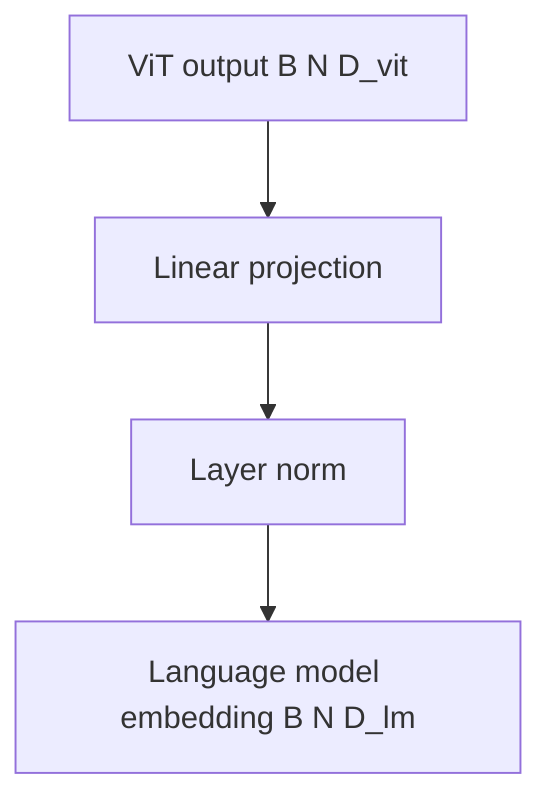

# 투영 레이어: 양식 정렬

> ViT(레슨 58-59)의 출력은 `(B, N, D_vit)` 형태입니다. 언어 모델의 임베딩 차원은 `D_lm`입니다. 이 둘은 일반적으로 다릅니다. 투영 레이어는 `D_vit`에서 `D_lm`으로의 학습 가능한 선형 변환입니다. 이 레슨은 ViT의 출력을 언어 모델의 임베딩 차원에 정렬하는 투영 레이어를 구축하고, 투영 레이어를 통해 형태가 올바르게 변환되는지 단위 테스트를 통해 확인합니다.

**Type:** Build
**Languages:** Python
**Prerequisites:** Phase 19 lessons 58-59
**Time:** ~60 minutes

## Learning Objectives

- `D_vit`에서 `D_lm`으로의 학습 가능한 선형 투영을 구현합니다.
- 배치 차원과 시퀀스 길이가 보존되는지 확인합니다.
- 무작위 ViT 출력에서 언어 모델 임베딩으로 투영되는지 단위 테스트를 통해 확인합니다.

## The Problem

ViT(레슨 58-59)는 형태 `(B, N, D_vit)`의 특징을 출력합니다. 언어 모델은 형태 `(B, S, D_lm)`의 임베딩을 기대하며, 여기서 `D_lm`은 일반적으로 `D_vit`보다 큽니다. 투영 레이어는 `D_vit`을 `D_lm`에 매핑하는 학습 가능한 선형 변환입니다.

## The Concept



### Linear projection

선형 투영은 ViT 임베딩 차원 `D_vit`을 언어 모델 임베딩 차원 `D_lm`에 매핑하는 학습 가능한 `nn.Linear(D_vit, D_lm)` 레이어입니다. 배치 차원과 시퀀스 길이는 보존됩니다.

### Optional layer norm

일부 비전-언어 모델은(예: LLaVA) 투영 후에 레이어 정규화를 추가합니다. 다른 모델은(예: BLIP-2) Q-포머를 추가합니다. 이 레슨은 간단한 선형 투영 + 선택적 레이어 정규화를 구현합니다.

## Build It

`code/main.py` implements:

- `ProjectionLayer` - ViT 출력 차원에서 언어 모델 임베딩 차원으로의 선형 변환. 선택적 `nn.LayerNorm` 포함.

파일 하단의 데모는 무작위 ViT 출력을 생성하고, 투영 레이어를 통해 전달하고, 출력 형태를 인쇄합니다.

Run it:

```bash
python3 code/main.py
```

스크립트는 0으로 종료되고 입력 및 출력 텐서 형태를 출력합니다.

## Production Patterns

두 가지 패턴이 이 레슨을 프로덕션 비전-언어 모델로 확장합니다.

**Projection is a learnable bridge.** 투영 레이어는 모델의 나머지 부분과 함께 학습됩니다. 비전-언어 모델이 언어 전용 및 비전 전용 체크포인트에서 초기화되면 무작위로 초기화된 유일한 레이어인 경우가 많습니다. 비전-언어 사전 훈련(레슨 62) 중에 투영 레이어는 ViT 출력을 언어 모델 임베딩 공간에 정렬하는 방법을 학습합니다.

**Pooling before projection (optional).** 일부 모델은 투영 전에 ViT 출력을 풀링합니다. 예를 들어, 평균 풀링은 시퀀스 길이 `N`을 단일 토큰으로 줄여서 `(B, 1, D_vit)`이 됩니다. 이는 언어 모델이 전체 이미지 시퀀스가 아닌 단일 이미지 토큰만 사용하는 비전-언어 모델에 유용합니다.

## Use It

프로덕션 패턴:

- **Projection is initialized as identity when D_vit == D_lm.** `D_vit == D_lm`이면 투영 레이어는 항등 행렬로 초기화되어야 합니다. 이렇게 하면 처음에 ViT의 의미가 보존되고 언어 모델이 천천히 조정됩니다.
- **Projection is initialized with xavier uniform.** `D_vit != D_lm`이면 투영 레이어는 `nn.init.xavier_uniform_`으로 초기화되어야 합니다.

## Ship It

`outputs/skill-projection-layer.md`는 실제 프로젝트에서 사용할 ViT 임베딩 차원 `D_vit`, 언어 모델 임베딩 차원 `D_lm` 및 투영 레이어가 ViT 출력을 어떻게 변환하는지 설명합니다. 이 레슨은 엔진을 제공합니다.

## Exercises

1. 투영 레이어에 드롭아웃을 추가하고 훈련 중에 활성화되는지 확인합니다.
2. 투영 레이어에 두 번째 선형 레이어를 추가하여 2-레이어 MLP 투영을 만듭니다.
3. 투영 전에 풀링을 추가하는 `--pooling` 플래그를 추가합니다: 옵션 `none`, `mean`, `max`.
4. 항등 행렬로 초기화되었을 때 `D_vit == D_lm`인 투영의 출력을 비교합니다.
5. ViT 출력의 일부만 언어 모델에 전달되도록 투영 레이어가 ViT 출력을 마스킹하는 `--mask-ratio` 플래그를 추가합니다.

## Key Terms

| Term | What people say | What it actually means |
|------|-----------------|------------------------|
| Projection | "Modality bridge" | ViT 출력 차원을 언어 모델 임베딩 차원에 매핑하는 선형 레이어 |
| Modality alignment | "Cross-modal matching" | 여러 양식의 표현이 동일한 임베딩 공간에 있도록 보장하는 프로세스 |
| Pooling | "Sequence reduction" | 여러 ViT 패치 임베딩을 단일 이미지 표현으로 집계 |

## Further Reading

- [Liu et al., Improved Baselines with Visual Instruction Tuning (arXiv 2310.03744)](https://arxiv.org/abs/2310.03744) - LLaVA-1.5의 투영 레이어 설계
- [Li et al., BLIP-2: Bootstrapping Language-Image Pre-training with Frozen Image Encoders and Large Language Models (arXiv 2301.12597)](https://arxiv.org/abs/2301.12597) - Q-포머 투영 설계
- Phase 19 · 58 - 비전 인코더 패치, 이 투영의 입력 생성
- Phase 19 · 59 - ViT 트랜스포머, 이 투영의 입력 생성
- Phase 19 · 62 - 비전-언어 사전 훈련, 투영 레이어가 모델의 나머지와 함께 학습됨
