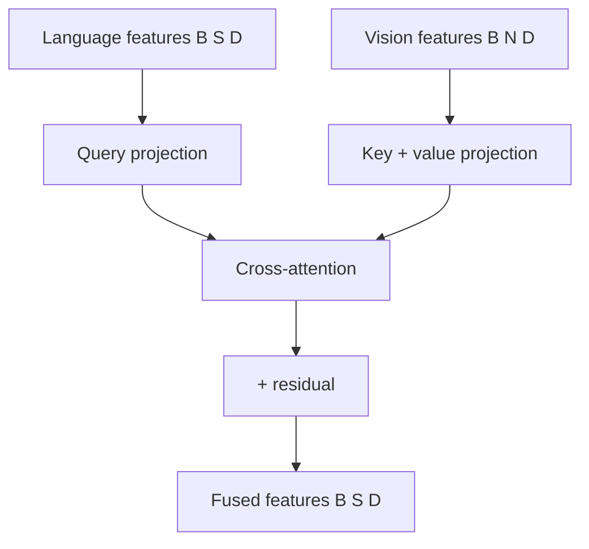

# 크로스-어텐션 퓨전

> 일부 비전-언어 모델은 언어 모델에 공급하기 전에 비전 특징과 언어 특징을 융합합니다. 투영 레이어(레슨 60)는 비전과 언어 특징을 동일한 차원으로 변환합니다. 크로스-어텐션 퓨전은 언어 쿼리가 비전 키와 값에 어텐션을 적용할 수 있게 하여 텍스트 설명이 이미지의 관련 부분에 집중할 수 있게 합니다. 이 레슨은 언어 시퀀스가 비전 시퀀스에 어텐션을 적용할 수 있게 하는 ViT 특징과 언어 특징을 위한 크로스-어텐션 퓨전 레이어를 구축합니다.

**Type:** Build
**Languages:** Python
**Prerequisites:** Phase 19 lessons 58-60
**Time:** ~60 minutes

## Learning Objectives

- 언어 특징을 쿼리로, 비전 특징을 키와 값으로 사용하는 크로스-어텐션 레이어를 구현합니다.
- 크로스-어텐션 레이어가 언어 시퀀스 길이를 유지하는지 확인합니다.
- 시퀀스의 각 언어 토큰이 시퀀스의 각 비전 토큰에 어텐션을 적용할 수 있는지 단위 테스트를 통해 확인합니다.

## The Problem

투영 레이어(레슨 60)는 ViT와 언어 특징을 동일한 차원으로 변환합니다. 그러나 이 특징들은 융합되지 않습니다. 언어 특징은 비전 특징을 알지 못합니다. 크로스-어텐션 퓨전은 언어 특징이 비전 특징에 어텐션을 적용할 수 있게 하여 각 언어 토큰이 이미지의 관련 부분을 참조할 수 있게 합니다.

## The Concept



### Cross-attention formulation

크로스-어텐션에서 언어 특징은 쿼리 `Q`를 생성하고, 비전 특징은 키 `K`와 값 `V`를 생성합니다. 어텐션 가중치는 `Q @ K^T / sqrt(d_k)`로 계산되고, 소프트맥스로 정규화되고, `V`를 가중합하는 데 사용됩니다. 언어 시퀀스 길이는 보존됩니다; 비전 시퀀스 길이는 어텐션 가중치에만 사용됩니다.

### Residual connection and normalization

표준 트랜스포머와 마찬가지로 크로스-어텐션은 잔차 연결로 래핑됩니다: `output = layer_norm(x + cross_attention(x, vision_features))`. 언어 특징은 시퀀스 길이를 유지합니다; 비전 특징은 키와 값에만 사용됩니다.

## Build It

`code/main.py` implements:

- `CrossAttentionFusion` - 언어 특징을 쿼리로, 비전 특징을 키와 값으로 사용하는 크로스-어텐션 레이어. 언어 시퀀스 길이를 유지합니다.
- `CrossAttentionBlock` - 레이어 정규화, 크로스-어텐션 및 잔차 연결을 포함하는 완전한 크로스-어텐션 블록.

파일 하단의 데모는 무작위 비전 특징과 언어 특징을 생성하고, 크로스-어텐션 퓨전 블록을 통해 전달하고, 출력 형태를 인쇄합니다.

Run it:

```bash
python3 code/main.py
```

스크립트는 0으로 종료되고 입력 및 출력 텐서 형태를 출력합니다.

## Production Patterns

두 가지 패턴이 이 레슨을 프로덕션 비전-언어 모델로 확장합니다.

**Causal masking for autoregressive decoding.** 언어 디코더가 자동회귀적으로 텍스트를 생성하는 경우, 크로스-어텐션은 언어 시퀀스에 인과적 마스킹을 적용해야 합니다. 각 언어 토큰은 이전 언어 토큰에만 어텐션을 적용할 수 있습니다. 비전 시퀀스는 마스킹되지 않습니다(모든 비전 토큰이 표시됨).

**Multiple cross-attention layers.** 일부 모델은 단일 크로스-어텐션 레이어 대신 언어 디코더 전체에 크로스-어텐션 레이어를 인터리브합니다. 이렇게 하면 언어 특징이 여러 처리 단계에서 비전 특징에 어텐션을 적용할 수 있습니다.

## Use It

프로덕션 패턴:

- **Cross-attention before or after self-attention.** 언어 디코더에서 크로스-어텐션은 일반적으로 셀프-어텐션 후, 피드포워드 네트워크 전에 배치됩니다. 이렇게 하면 언어 특징이 비전 특징에 어텐션을 적용하기 전에 먼저 자체적으로 어텐션을 적용합니다.
- **Cross-attention with multiple vision sources.** 비전 특징이 여러 ViT 레이어에서 오는 경우(다중 스케일 특징), 크로스-어텐션은 각각 자체 키/값 투영을 가진 여러 비전 소스에 어텐션을 적용할 수 있습니다.

## Ship It

`outputs/skill-cross-attention-fusion.md`는 실제 프로젝트에서 사용할 크로스-어텐션 레이어 수, 언어 디코더에서의 위치 및 비전 시퀀스에 인과적 마스킹이 적용되는지 여부를 설명합니다. 이 레슨은 엔진을 제공합니다.

## Exercises

1. 크로스-어텐션 레이어에 인과적 마스킹을 추가합니다: 각 언어 토큰은 이전 언어 토큰에만 어텐션을 적용할 수 있습니다. 비전 토큰은 마스킹되지 않습니다.
2. 다중 헤드 크로스-어텐션을 추가합니다: 헤드 수가 `num_heads`인 크로스-어텐션.
3. 언어 디코더 전체에 크로스-어텐션 블록을 인터리브하는 다중 크로스-어텐션 레이어를 추가합니다.
4. 비전 특징에 대한 드롭아웃을 추가합니다. 훈련 중에 각 비전 토큰이 확률 `p`로 드롭됩니다.
5. 크로스-어텐션 블록을 통과할 때 언어 시퀀스 길이가 유지되는지 확인하는 단위 테스트를 추가합니다.

## Key Terms

| Term | What people say | What it actually means |
|------|-----------------|------------------------|
| Cross-attention | "Vision attends to language" | 언어 쿼리가 비전 키/값에 어텐션을 적용하는 어텐션 메커니즘 |
| Causal masking | "Future masking" | 각 언어 토큰이 이전 언어 토큰에만 어텐션을 적용하도록 하는 마스크 |
| Fused features | "Multi-modal features" | 크로스-어텐션을 통해 비전 및 언어 정보를 모두 포함하는 특징 |

## Further Reading

- [Vaswani et al., Attention Is All You Need (NeurIPS 2017)](https://arxiv.org/abs/1706.03762) - 원본 트랜스포머의 인코더-디코더 어텐션(크로스-어텐션)
- [Alayrac et al., Flamingo: a Visual Language Model for Few-Shot Learning (NeurIPS 2022)](https://arxiv.org/abs/2204.14198) - 크로스-어텐션 퓨전을 사용한 비전-언어 모델
- [Liu et al., Visual Instruction Tuning (NeurIPS 2023)](https://arxiv.org/abs/2304.08485) - LLaVA: 크로스-어텐션 없이 투영 레이어 퓨전만 사용
- Phase 19 · 60 - 투영 레이어: 이 레슨의 입력 생성
- Phase 19 · 62 - 비전-언어 사전 훈련: 이 크로스-어텐션 퓨전이 모델과 함께 학습됨
