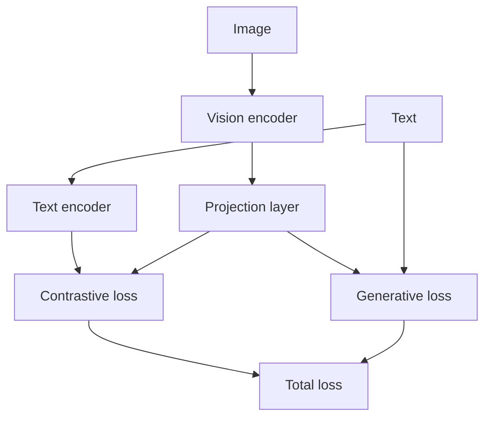

# 비전-언어 사전 훈련

> 비전-언어 모델은 이미지와 텍스트 쌍으로 사전 훈련됩니다. 사전 훈련 목적은 모델이 두 양식을 함께 이해하도록 가르치는 것입니다. 이 레슨은 대비적 손실(이미지-텍스트 쌍 정렬을 위한 InfoNCE)과 생성적 손실(이미지가 주어졌을 때 텍스트 생성을 위한 언어 모델링)을 결합한 비전-언어 사전 훈련 루프를 구축합니다. 이 레슨은 비전 인코더(레슨 58-59), 투영 레이어(레슨 60) 또는 크로스-어텐션 퓨전(레슨 61)과 언어 모델을 결합합니다.

**Type:** Build
**Languages:** Python
**Prerequisites:** Phase 19 lessons 58-61
**Time:** ~90 minutes

## Learning Objectives

- 이미지-텍스트 쌍 정렬을 위한 대비적 손실(InfoNCE)을 구현합니다.
- 이미지가 주어졌을 때 텍스트를 생성하기 위한 생성적 손실(언어 모델링)을 구현합니다.
- 두 손실을 결합한 비전-언어 사전 훈련 루프를 구축합니다.

## The Problem

비전-언어 모델은 이미지와 텍스트를 쌍으로 연결하는 방법을 배워야 합니다. 사전 훈련 중에 두 가지 손실이 사용됩니다:

- **대비적 손실(InfoNCE)** - 이미지-텍스트 쌍의 임베딩을 함께 당기고, 쌍을 이루지 않은 임베딩을 밀어냅니다. 이 손실은 이미지와 텍스트 표현을 정렬합니다.
- **생성적 손실(언어 모델링)** - 이미지가 주어졌을 때 텍스트를 생성하는 모델의 능력을 최적화합니다.

두 손실은 모델의 다른 측면을 최적화하기 때문에 결합됩니다: 대비적 손실은 이미지-텍스트 정렬을 개선하고, 생성적 손실은 텍스트 생성 품질을 개선합니다.

## The Concept



### Contrastive loss (InfoNCE)

InfoNCE 손실은 배치 내에서 올바른 이미지-텍스트 쌍을 식별합니다. 배치에는 `N`개의 이미지-텍스트 쌍 `(I_i, T_i)`가 포함되어 있습니다. 이미지 임베딩 `v_i`와 텍스트 임베딩 `t_i`가 계산됩니다. 각 이미지 `i`에 대해 손실은 올바른 텍스트 `t_i`와 모든 `N` 텍스트 임베딩 간의 유사도 로그 소프트맥스의 음의 로그 우도입니다.

### Generative loss (language modeling)

생성적 손실은 표준 언어 모델링 손실입니다: 이미지 임베딩이 주어졌을 때 텍스트의 각 토큰에 대한 다음 토큰 예측의 교차 엔트로피입니다. 이미지 임베딩은 이미지 조건부 언어 모델링을 위한 프롬프트/컨텍스트로 사용됩니다.

### Combined loss

총 손실은 대비적 손실과 생성적 손실의 가중 합계입니다: `L_total = lambda_c * L_contrastive + lambda_g * L_generative`. `lambda_c`와 `lambda_g`는 하이퍼파라미터입니다.

## Build It

`code/main.py` implements:

- `ContrastiveLoss` - 배치 내 이미지-텍스트 정렬을 위한 InfoNCE 손실.
- `GenerativeLoss` - 이미지 조건부 텍스트 생성의 교차 엔트로피.
- `VisionLanguagePretraining` - 모델(비전 인코더 + 투영 레이어 + 언어 모델)과 두 손실을 결합합니다.
- `VLPipeline` - 이미지-텍스트 쌍 데이터로더와 사전 훈련 루프.

파일 하단의 데모는 합성 이미지-텍스트 쌍 데이터셋을 생성하고, 사전 훈련 루프를 실행하고, 손실 곡선을 출력합니다.

Run it:

```bash
python3 code/main.py
```

스크립트는 0으로 종료되고 각 에폭 후의 손실 곡선을 출력합니다.

## Production Patterns

세 가지 패턴이 이 레슨을 프로덕션 비전-언어 사전 훈련으로 확장합니다.

**Batch size for contrastive loss.** InfoNCE는 배치 내 부정 예제에 의존합니다. 배치 크기가 클수록 더 많은 부정 예제를 생성하여 더 나은 정렬을 제공합니다. 큰 배치 크기는 GPU 메모리에 의해 제한되며, 그라디언트 누적(레슨 46)이 필요할 수 있습니다.

**Image-text pair quality.** 사전 훈련 데이터의 품질이 중요합니다. 잘못 정렬된 이미지-텍스트 쌍은 노이즈가 많은 그라디언트를 생성합니다. 데이터 필터링(예: CLIP 점수로 쌍 필터링)이 일반적입니다.

**Warmup for both losses.** 대비적 손실과 생성적 손실 모두에 대해 학습률 웜업이 권장됩니다. 학습률이 너무 빨리 피크에 도달하면 모델이 발산할 수 있습니다.

## Use It

프로덕션 패턴:

- **Evaluation during pretraining.** 사전 훈련 중에 모델은 제로샷 이미지 분류(대비적 손실 사용) 또는 이미지 캡셔닝(생성적 손실 사용)에서 평가되어야 합니다.
- **Checkpointing.** 사전 훈련 체크포인트는 저장되어야 합니다. 비전-언어 사전 훈련에는 며칠이 걸릴 수 있으므로, 충돌 시 재개를 위해 체크포인트가 필요합니다.
- **Mixed precision.** 사전 훈련은 메모리 효율성을 위해 혼합 정밀도(레슨 45)를 사용해야 합니다.

## Ship It

`outputs/skill-vl-pretraining.md`는 실제 프로젝트에서 사용할 두 손실의 가중치(`lambda_c`, `lambda_g`), 이미지-텍스트 쌍 데이터셋의 소스 및 사전 훈련 기간을 설명합니다. 이 레슨은 엔진을 제공합니다.

## Exercises

1. InfoNCE의 온도 파라미터를 추가하고 손실 곡선에 미치는 영향을 비교합니다.
2. 대비적 손실만 또는 생성적 손실만으로 사전 훈련을 실행하는 `--loss-type` 플래그를 추가합니다.
3. 사전 훈련 중에 모델을 제로샷 이미지 분류에서 평가하는 `--eval-every` 플래그를 추가합니다.
4. InfoNCE에서 하드 부정 예제 마이닝을 추가합니다: 배치 내에서 가장 가까운 부정 예제가 업데이트에 더 많은 기여를 합니다.
5. 체크포인팅 및 재개 지원을 추가합니다.

## Key Terms

| Term | What people say | What it actually means |
|------|-----------------|------------------------|
| Contrastive loss | "Align pairs" | 올바른 이미지-텍스트 쌍은 임베딩 공간에서 함께 당기고, 올바르지 않은 쌍은 밀어냄 |
| InfoNCE | "Noise contrastive" | 배치 내에서 올바른 쌍을 식별하는 대비적 손실 |
| Generative loss | "Captioning loss" | 이미지가 주어졌을 때 텍스트를 생성하는 교차 엔트로피 |
| Vision-language pretraining | "Multi-modal training" | 이미지-텍스트 쌍에서 비전-언어 모델을 사전 훈련하는 프로세스 |
| Zero-shot evaluation | "No fine-tuning" | 다운스트림 작업에 대해 추가 훈련 없이 사전 훈련된 모델 평가 |

## Further Reading

- [Radford et al., Learning Transferable Visual Models From Natural Language Supervision (ICML 2021)](https://arxiv.org/abs/2103.00020) - CLIP 및 대비적 사전 훈련
- [Li et al., BLIP: Bootstrapping Language-Image Pre-training for Unified Vision-Language Understanding and Generation (ICML 2022)](https://arxiv.org/abs/2201.12086) - 대비적 손실과 생성적 손실 결합
- [Oord et al., Representation Learning with Contrastive Predictive Coding (arXiv 1807.03748)](https://arxiv.org/abs/1807.03748) - InfoNCE 손실의 원본
- Phase 19 · 58 - 비전 인코더 패치(이 사전 훈련의 비전 구성 요소)
- Phase 19 · 59 - ViT 트랜스포머(이 사전 훈련의 비전 구성 요소)
- Phase 19 · 60 - 투영 레이어(양식 정렬)
- Phase 19 · 61 - 크로스-어텐션 퓨전(양식 융합)
- Phase 19 · 63 - 비전-언어 평가(이 사전 훈련의 평가)
