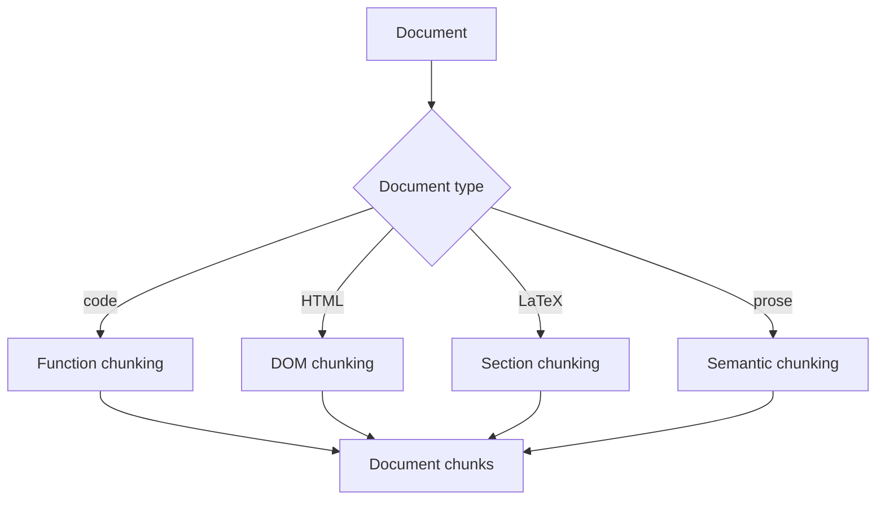

# 고급 청킹 전략

> RAG 시스템은 문서를 검색 가능한 청크로 분할합니다. 기본 청킹(고정 크기, 중복)은 많은 문서에 대해 잘 작동하지만, 코드, 표 및 복잡한 마크다운에 대해서는 실패합니다. 이 레슨은 의미적 청킹(문장 임베딩을 사용한 경계 감지), 에이전트 청킹(LLM이 분할 위치 결정) 및 문서별 청킹(코드 함수, HTML, LaTeX)을 포함한 고급 청킹 전략을 구현합니다.

**Type:** Build
**Languages:** Python
**Prerequisites:** Phase 19 lessons 30-37
**Time:** ~90 minutes

## Learning Objectives

- 문장 임베딩 거리를 사용하여 청크 경계를 감지하는 의미적 청킹을 구현합니다.
- LLM을 사용하여 콘텐츠를 청크로 분할할 위치를 결정하는 에이전트 청킹을 구현합니다.
- 코드(함수 중심), HTML(DOM 기반) 및 LaTeX(섹션 기반)에 대한 문서별 청킹을 구현합니다.

## The Problem

기본 청킹은 고정 크기와 선택적 중복을 사용합니다. 간단한 산문 텍스트에는 잘 작동하지만 구조화된 문서에는 실패합니다. 코드는 함수 경계에서 분할되어야 합니다. HTML은 DOM 구조를 따라 분할되어야 합니다. LaTeX은 섹션에서 분할되어야 합니다. 기본 청킹이 이러한 구조를 무시하면 의미를 깨는 검색 가능한 청크가 생성됩니다.

## The Concept



### Semantic chunking

의미적 청킹은 문장 임베딩을 사용하여 주제 전환(청크 경계)을 감지합니다. 각 문장이 임베딩됩니다. 연속된 문장 사이의 코사인 유사도가 계산됩니다. 유사도가 임계값 아래로 떨어지면 청크 경계가 배치됩니다.

### Agentic chunking

에이전트 청킹은 LLM을 사용하여 문서를 청크로 분할합니다. LLM에는 청킹 지침과 함께 문서가 제공됩니다. LLM은 청크 경계를 결정합니다. 에이전트 청킹은 가장 유연한 접근 방식이지만 비용이 많이 듭니다.

### Document-specific chunking

각 문서 유형은 청킹 전략을 결정합니다. 코드는 함수(함수 시그니처 및 docstring)로 분할됩니다. HTML은 DOM(섹션, 제목, div)으로 분할됩니다. LaTeX은 섹션(`\section`, `\subsection`)으로 분할됩니다.

## Build It

`code/main.py` implements:

- `SemanticChunker` - 문장 임베딩을 사용한 의미적 청킹. 임베딩 거리가 임계값을 초과하면 청크 경계를 배치합니다.
- `AgenticChunker` - LLM을 사용한 에이전트 청킹. 청킹 지침이 제공된 LLM이 청크 경계를 결정합니다.
- `CodeChunker` - 코드에 대한 함수 단위 청킹. 함수 시그니처와 docstring으로 분할됩니다.
- `HTMLChunker` - HTML에 대한 DOM 기반 청킹. 섹션 및 제목으로 분할됩니다.
- `LatexChunker` - LaTeX에 대한 섹션 기반 청킹. `//section` 및 `//subsection`으로 분할됩니다.
- `ChunkingPipeline` - 문서 유형 감지 및 적절한 청킹 전략 선택.

파일 하단의 데모는 다양한 문서 유형(산문, 코드, HTML, LaTeX)을 생성하고, 각 문서에 대한 청크를 생성하고, 청크 수를 출력합니다.

Run it:

```bash
python3 code/main.py
```

스크립트는 0으로 종료되고 문서 유형별 청크 수를 출력합니다.

## Production Patterns

세 가지 패턴이 이 레슨을 프로덕션 RAG 시스템으로 확장합니다.

**Chunk metadata.** 각 청크에는 소스 문서, 청크 색인, 청킹 전략 및 임베딩을 포함한 메타데이터가 주석으로 추가되어야 합니다. 메타데이터는 검색 순위 매기기 및 다운스트림 처리를 지원합니다.

**Chunk overlap.** 청킹 전략에 관계없이 청크 사이에 약간의 중복(예: 1-2문장)이 청크 경계에서 문맥 손실을 방지합니다.

**Chunk caching.** 문서가 변경되지 않은 경우 청크가 캐시되어야 합니다. 문서 해시에 의해 키가 지정된 콘텐츠 주소 지정 가능 캐시가 청킹 재계산을 방지합니다.

## Use It

프로덕션 패턴:

- **Multiple chunking strategies per document.** 산문과 코드를 모두 포함하는 문서는 두 전략을 모두 사용해야 합니다(산문에 대한 의미적, 코드에 대한 함수 기반). 청킹 파이프라인은 여러 전략을 지원해야 합니다.
- **Chunk size limits.** 청킹 전략에 관계없이 생성된 청크에는 최대 크기(예: 512 토큰)가 적용되어야 합니다. 더 큰 청크는 다운스트림 검색 및 생성을 더 어렵게 만듭니다.
- **Evaluation of chunking quality.** 청킹 품질은 다운스트림 검색 재현율에 대해 평가되어야 합니다. 우수한 청킹은 더 높은 검색 재현율을 생성합니다.

## Ship It

`outputs/skill-chunking-strategies.md`는 실제 프로젝트에서 사용할 청킹 전략, 청킹 매개변수 및 청킹 품질이 평가되는 방법을 설명합니다. 이 레슨은 엔진을 제공합니다.

## Exercises

1. 청킹 전략 사이의 중복 크기를 제어하는 `--overlap` 플래그를 추가합니다.
2. 문서 해시에 의해 키가 지정된 청킹 캐시를 추가합니다.
3. 검색 재현율로 청킹 품질을 평가하는 `--eval-chunking` 플래그를 추가합니다.
4. PDF 및 마크다운에 대한 문서별 청킹을 추가합니다.
5. 저장된 청크에서 검색 결과를 재구성할 수 있도록 청킹 메타데이터를 저장합니다.

## Key Terms

| Term | What people say | What it actually means |
|------|-----------------|------------------------|
| Semantic chunking | "Topic-based split" | 문장 임베딩 거리를 사용한 청크 경계 감지 |
| Agentic chunking | "LLM decides split" | LLM을 사용하여 청크 경계 결정 |
| Document-specific chunking | "Type-based split" | 문서 유형에 특화된 청킹(코드, HTML, LaTeX) |
| Chunk metadata | "Chunk annotations" | 청크에 대한 출처, 색인 및 전략 메타데이터 |
| Chunk overlap | "Context window" | 문맥 손실을 방지하기 위한 청크 간 중복 |

## Further Reading

- [LangChain text splitters documentation](https://python.langchain.com/docs/modules/data_connection/document_transformers/) - 청킹 전략에 대한 실용적인 참조
- [ChunkViz: Chunking Strategy Visualization (GitHub)](https://github.com/romanolat/chunkviz) - 청킹 전략 시각화 도구
- Phase 19 · 65 - 하이브리드 검색(BM25 + 밀집), 청킹에서 생성된 청크 사용
- Phase 19 · 66 - 재순위화기(크로스-인코더), 청킹에서 생성된 청크 사용
- Phase 19 · 69 - 엔드-투-엔드 RAG 시스템, 이 청킹을 파이프라인에 통합
