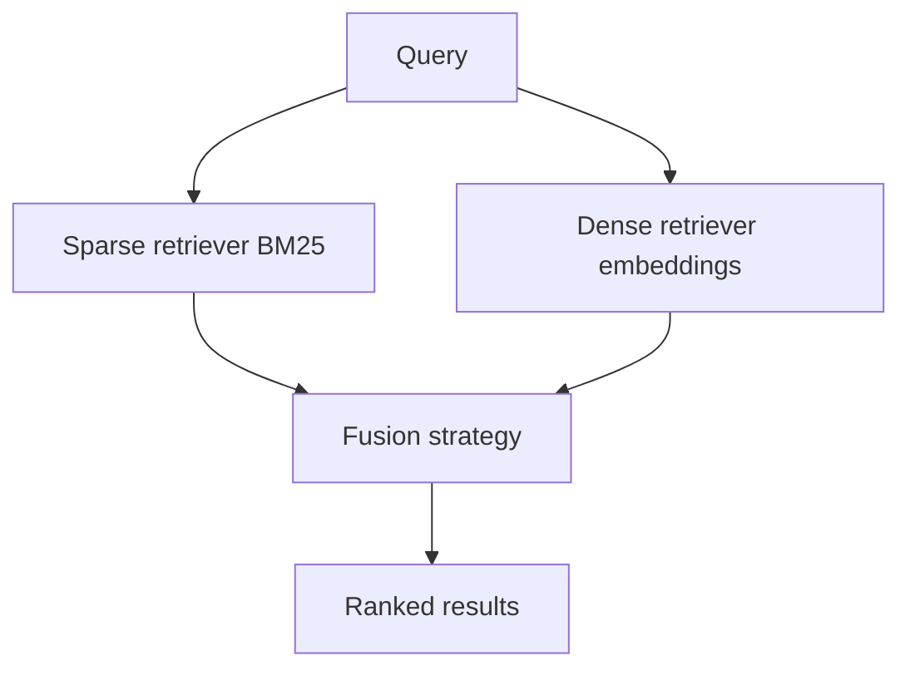

# 하이브리드 검색: BM25 + 밀집

> RAG 시스템은 관련 문서를 검색하기 위해 검색기에 의존합니다. 희소 검색(BM25)은 키워드 일치에 탁월합니다. 밀집 검색(임베딩 유사도)은 의미적 유사도에 탁월합니다. 하이브리드 검색은 두 가지를 결합하여 각각의 강점을 활용합니다. 이 레슨은 BM25 검색기와 밀집 검색기를 구현하고, 결과를 결합하는 퓨전 전략(상호 순위 퓨전, 가중 합계)을 구현하며, 단일 검색기와 비교하여 하이브리드 검색의 재현율 개선을 평가합니다.

**Type:** Build
**Languages:** Python
**Prerequisites:** Phase 19 lessons 30-37
**Time:** ~90 minutes

## Learning Objectives

- 희소 키워드 검색을 위해 BM25 검색기를 구현합니다.
- 의미적 유사도 검색을 위해 밀집 검색기(임베딩 기반)를 구현합니다.
- 두 검색기 결과를 결합하는 퓨전 전략(상호 순위 퓨전, 가중 합계)을 구현합니다.
- 단일 검색기와 비교하여 하이브리드 검색의 재현율 개선을 평가합니다.

## The Problem

희소 검색(BM25)은 키워드가 일치할 때 잘 작동합니다. 밀집 검색(임베딩)은 키워드가 없을 때(동의어, 패러프레이징) 잘 작동합니다. 하이브리드 검색은 두 가지를 모두 사용하여 견고한 검색을 제공합니다. 희소 검색은 정확한 키워드 일치를 포착합니다. 밀집 검색은 의미적 유사도를 포착합니다.

## The Concept



### BM25 (sparse retriever)

BM25은 쿼리와 문서 간의 키워드 기반 유사도를 계산합니다. 용어 빈도(TF), 역문서 빈도(IDF) 및 문서 길이 정규화의 가중 조합입니다. 희소 검색기는 키워드 일치에 탁월합니다.

### Dense retriever (embedding)

밀집 검색기는 문서와 쿼리를 임베딩으로 인코딩합니다. 검색기는 쿼리 임베딩과 문서 임베딩 간의 코사인 유사도를 계산합니다. 밀집 검색기는 의미적 유사도에 탁월합니다.

### Fusion strategies

두 검색기의 결과는 퓨전 전략을 통해 결합됩니다:

- **상호 순위 퓨전(MRF)** - 각 문서는 각 검색기에서의 순위를 기반으로 점수가 매겨집니다. 점수는 `1 / (k + rank)`입니다. 최종 점수는 검색기 전체에 걸친 점수의 합계입니다.
- **가중 합계(W Sum)** - 각 검색기의 점수는 정규화된 다음 합산됩니다. 각 검색기의 가중치는 하이퍼파라미터입니다.

### Evaluation

하이브리드 검색은 단일 검색기와 비교하여 재현율 개선에 대해 평가됩니다. 재현율@K는 상위 K개 결과에 대한 올바른 검색의 비율을 측정합니다.

## Build It

`code/main.py` implements:

- `BM25Retriever` - BM25 점수를 계산하는 희소 검색기.
- `DenseRetriever` - 문서 및 쿼리의 임베딩을 계산하는 밀집 검색기.
- `HybridRetriever` - 퓨전 전략으로 검색기를 결합합니다.
- `FusionStrategy` - MRF 및 가중 합계 퓨전을 구현합니다.
- `RetrievalEvaluator` - 재현율@K에서 하이브리드 검색과 단일 검색기를 비교합니다.

파일 하단의 데모는 문서 코퍼스를 생성하고, BM25 및 밀집 색인을 구축하고, 하이브리드 검색기로 쿼리하고, 검색 결과를 평가합니다.

Run it:

```bash
python3 code/main.py
```

스크립트는 0으로 종료되고 단일 검색기와 하이브리드 검색기의 재현율@K를 출력합니다.

## Production Patterns

세 가지 패턴이 이 레슨을 프로덕션 검색 시스템으로 확장합니다.

**Embedding cache for dense retrieval.** 밀집 검색기는 각 쿼리에 대한 임베딩을 계산해야 합니다. 임베딩은 성능을 위해 캐시되어야 합니다. 쿼리 해시에 의해 키가 지정된 캐시가 재계산을 방지합니다.

**BM25 index refresh.** 문서가 추가 또는 제거되면 BM25 색인이 새로고침되어야 합니다. 증분 색인 업데이트는 문서 변경으로 BM25 용어 통계가 변경될 때 필요합니다.

**Fusion weight tuning.** 각 검색기에 대한 가중치는 검증 세트에서 튜닝되어야 합니다. 검증 재현율을 최적화하는 가중치가 프로덕션에 사용됩니다.

## Use It

프로덕션 패턴:

- **Cache retrieval results for repeated queries.** 동일한 쿼리가 여러 번 실행되는 경우 검색 결과가 캐시되어야 합니다. 쿼리 해시에 의해 키가 지정된 캐시가 재계산을 방지합니다.
- **Evaluate retrieval on multiple datasets.** 검색 재현율은 여러 데이터셋에서 평가되어야 합니다. 단일 데이터셋의 성능은 다른 데이터셋으로 일반화되지 않을 수 있습니다.
- **Filter before retrieval.** 큰 코퍼스의 경우 검색 전에 필터링(메타데이터 기준)이 검색 공간을 줄입니다.

## Ship It

`outputs/skill-hybrid-retrieval.md`는 실제 프로젝트에서 사용할 퓨전 전략, 검색기 가중치 및 검색 재현율이 평가되는 방법을 설명합니다. 이 레슨은 엔진을 제공합니다.

## Exercises

1. 퓨전 전략에 대한 가중치를 제어하는 `--fusion-weights` 플래그를 추가합니다.
2. 쿼리 해시에 의해 키가 지정된 임베딩 캐시를 추가합니다.
3. 재현율@K 및 정밀도@K로 하이브리드 검색과 단일 검색기를 비교하는 평가 모드를 추가합니다.
4. 문서가 추가/제거될 때 BM25 색인을 새로고침하는 증분 색인 업데이트를 추가합니다.
5. 검증 재현율에서 최상의 퓨전 가중치를 검색하는 검색기 가중치 스윕을 추가합니다.

## Key Terms

| Term | What people say | What it actually means |
|------|-----------------|------------------------|
| BM25 | "Sparse retriever" | TF-IDF와 유사한 키워드 기반 검색 함수 |
| Dense retriever | "Embedding search" | 의미적 유사도를 위한 임베딩 기반 검색 |
| Hybrid retrieval | "Combined search" | 희소 검색과 밀집 검색의 결과를 결합 |
| Reciprocal rank fusion | "RRF" | 각 검색기의 순위(희소 및 밀집)를 기반으로 문서 점수를 매기는 퓨전 전략 |
| Recall@K | "Hit rate" | 상위 K개 문서에서 올바른 검색 결과의 비율 |

## Further Reading

- [Robertson and Zaragoza, The Probabilistic Relevance Framework (Foundations and Trends in IR 2009)](https://dl.acm.org/doi/10.1561/1500000019) - BM25의 기초
- [Reimers and Gurevych, Sentence-BERT (EMNLP 2019)](https://arxiv.org/abs/1908.10084) - 밀집 검색 임베딩
- [Cormack et al., Reciprocal Rank Fusion (SIGIR 2009)](https://dl.acm.org/doi/10.1145/1571941.1572114) - MRF 퓨전 전략
- Phase 19 · 64 - 고급 청킹 전략(하이브리드 검색에 공급되는 청크)
- Phase 19 · 66 - 재순위화기(크로스-인코더, 하이브리드 검색 이후 순위 조정)
- Phase 19 · 69 - 엔드-투-엔드 RAG 시스템(이 검색기 통합)
