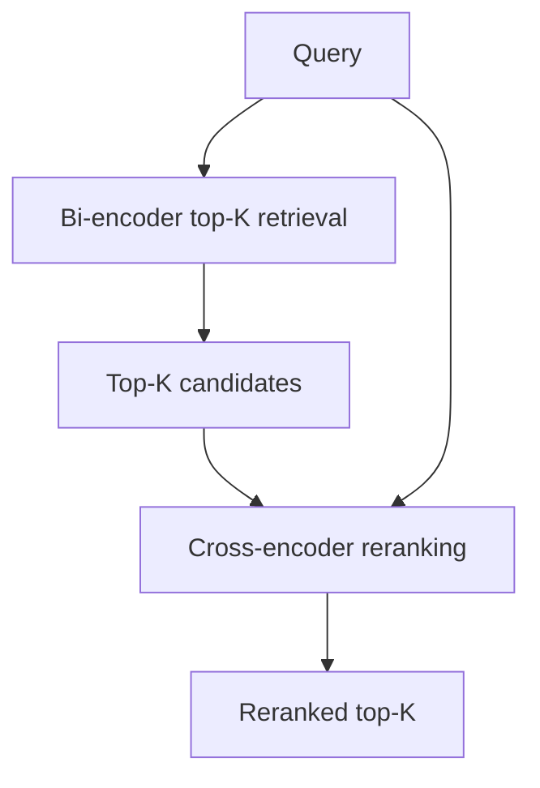

# 재순위화기: 크로스-인코더

> 초기 검색기(레슨 65)는 관련성 있는 문서의 상위 K개 후보를 반환합니다. 이러한 후보는 순위가 재조정되어야 합니다: 가장 관련성 높은 문서가 상위에 있어야 합니다. 크로스-인코더 재순위화기는 쿼리-문서 쌍을 공동으로 인코딩하여 더 정확한 관련성 점수를 생성합니다. 이 레슨은 쿼리-문서 쌍의 이진 분류(관련성/비관련성)를 위해 미세 조정된 크로스-인코더 모델을 구현하고, Bi-인코더(레슨 65)와 비교하여 재순위화의 정확도 향상을 평가합니다.

**Type:** Build
**Languages:** Python
**Prerequisites:** Phase 19 lessons 65
**Time:** ~90 minutes

## Learning Objectives

- 쿼리-문서 쌍의 이진 분류를 위해 미세 조정된 크로스-인코더 모델을 구현합니다.
- 쿼리-문서 쌍의 관련성을 예측하기 위해 크로스-인코더 추론을 실행합니다.
- Bi-인코더(레슨 65)와 비교하여 재순위화의 정확도 향상을 평가합니다.

## The Problem

Bi-인코더(레슨 65)는 효율적이지만 덜 정확합니다. 크로스-인코더는 더 정확하지만 느립니다. 재순위화기는 이를 결합합니다: Bi-인코더가 상위 K개 후보를 빠르게 검색합니다; 크로스-인코더가 K개의 쿼리-문서 쌍을 재순위화합니다. 이 하이브리드는 효율성과 정확성 간의 균형을 유지합니다.

## The Concept



### Cross-encoder architecture

크로스-인코더는 쿼리와 문서를 공동으로 인코딩합니다. `[CLS] query [SEP] document [SEP]` 형식으로 연결된 입력을 받습니다. 출력은 관련성/비관련성을 예측하는 단일 스칼라 점수(로짓)입니다. 디코더 전용 모델의 경우, 형식은 선호도에 따라 `query\ndocument`일 수 있습니다. 크로스-인코더는 계산 비용이 많이 들기 때문에(K개의 쌍에 대해 K번의 순전파 필요) 재순위화에만 사용됩니다.

### Reranking pipeline

파이프라인은 검색기를 사용하여 검색합니다(레슨 65, Bi-인코더 사용). 쿼리와 상위 K개 문서가 쌍을 이룹니다. 각 쌍이 크로스-인코더를 통과합니다. 크로스-인코더 점수가 문서를 재순위화합니다. 재순위화된 상위 K개가 반환됩니다.

### Evaluation

재순위화 정확도는 순위 재조정 후 재현율@K에 대해 평가됩니다. 재순위화기는 Bi-인코더 검색 단독과 비교되어야 합니다.

## Build It

`code/main.py` implements:

- `CrossEncoderReranker` - 쿼리-문서 쌍의 관련성을 예측하는 크로스-인코더 모델. `[CLS] query [SEP] document [SEP]`를 인코딩하고 이진 분류 로짓을 출력합니다.
- `RerankingPipeline` - 검색기(레슨 65)와 재순위화기를 결합합니다: 검색, 쌍 구성, 재순위화, 재순위화된 결과 반환.
- `RerankingEvaluator` - 재순위화 전후의 재현율@K를 비교합니다.

파일 하단의 데모는 문서 코퍼스를 생성하고, 검색기로 검색하고, 크로스-인코더로 재순위화하고, 평가를 출력합니다.

Run it:

```bash
python3 code/main.py
```

스크립트는 0으로 종료되고 재순위화 전후의 재현율@K를 출력합니다.

## Production Patterns

세 가지 패턴이 이 레슨을 프로덕션 RAG 시스템으로 확장합니다.

**Batch inference on GPU.** 크로스-인코더 추론은 GPU에서 더 빠릅니다. K개의 쿼리-문서 쌍은 GPU 메모리에 맞는 경우 단일 배치로 처리되거나 여러 배치로 분할됩니다.

**Caching cross-encoder scores.** 동일한 쿼리-문서 쌍이 여러 번 평가되는 경우(예: 여러 사용자가 유사한 쿼리를 실행하는 경우), 크로스-인코더 점수가 캐시되어야 합니다. 쿼리-문서 해시에 의해 키가 지정된 캐시가 재계산을 방지합니다.

**Reranking with multiple cross-encoders.** 다양한 도메인 또는 언어에 특화된 여러 크로스-인코더가 재순위화에 사용될 수 있습니다. 파이프라인은 쿼리 도메인에 따라 적절한 재순위화기를 선택해야 합니다.

## Use It

프로덕션 패턴:

- **K for reranking is a hyperparameter.** 재순위화할 문서의 수 `K`는 하이퍼파라미터입니다. K가 클수록 재순위화 정확도가 향상되지만 비용이 증가합니다. 검증 세트에서 최적의 K를 찾으십시오.
- **Reranking with query expansion.** 재순위화 정확도는 쿼리 확장(레슨 67)으로 개선됩니다. 쿼리 확장이 먼저 실행된 다음 확장된 쿼리가 재순위화에 사용됩니다.
- **Ensemble reranking.** 여러 크로스-인코더의 관련성 점수는 최종 점수로 집계될 수 있습니다. 앙상블 재순위화는 단일 크로스-인코더보다 더 나은 정확도를 제공합니다.

## Ship It

`outputs/skill-reranker.md`는 실제 프로젝트에서 사용할 K(재순위화할 문서 수), 크로스-인코더 모델 및 재순위화 정확도가 평가되는 방법을 설명합니다. 이 레슨은 엔진을 제공합니다.

## Exercises

1. 크로스-인코더 추론을 위한 GPU 가속을 추가합니다.
2. 쿼리-문서 해시에 의해 키가 지정된 점수 캐싱을 추가합니다.
3. 재순위화 전후의 재현율@K를 비교하는 평가 모드를 추가합니다.
4. 여러 크로스-인코더의 점수를 집계하는 앙상블 재순위화를 추가합니다.
5. 크로스-인코더와 검색기 사이의 K를 제어하는 `--rerank-k` 플래그를 추가합니다.

## Key Terms

| Term | What people say | What it actually means |
|------|-----------------|------------------------|
| Cross-encoder | "Joint encoder" | 쿼리-문서를 공동으로 인코딩하고 관련성 로짓을 출력하는 모델 |
| Reranking | "Reordering" | 초기 검색 후 크로스-인코더 점수로 문서 재정렬 |
| Reranking pipeline | "Retrieve then rerank" | 초기 검색(레슨 65)과 크로스-인코더 재순위화 결합 |
| Reranking K | "Rerank depth" | 재순위화를 위해 검색기에서 가져올 상위 K개 문서 |

## Further Reading

- [Nogueira and Cho, Passage Re-ranking with BERT (arXiv 1901.04085)](https://arxiv.org/abs/1901.04085) - 크로스-인코더 순위 재조정의 원본
- [Reimers and Gurevych, Sentence-BERT (EMNLP 2019)](https://arxiv.org/abs/1908.10084) - Bi-인코더 및 크로스-인코더 변형
- Phase 19 · 65 - 하이브리드 검색(재순위화 파이프라인의 Bi-인코더 검색기)
- Phase 19 · 67 - 쿼리 재작성(HyDE), 재순위화 전에 더 나은 쿼리 생성
- Phase 19 · 69 - 엔드-투-엔드 RAG 시스템(재순위화기를 파이프라인에 통합)
