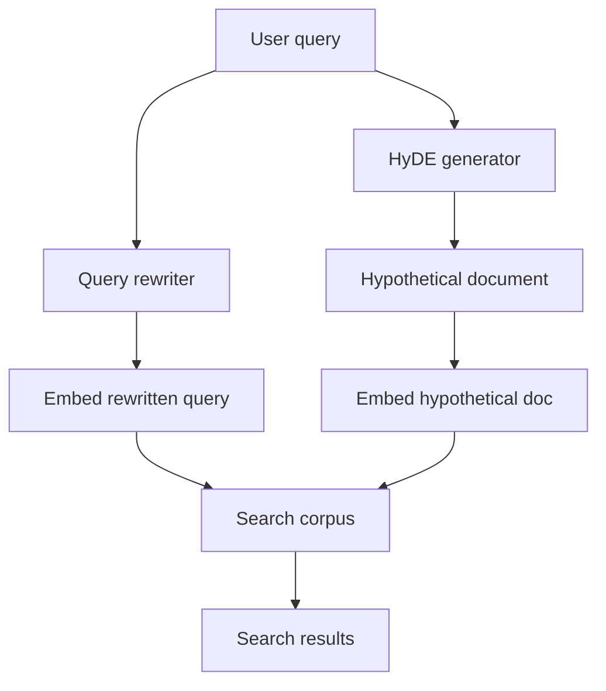

# 쿼리 재작성 및 HyDE

> 사용자 쿼리는 종종 모호합니다. 검색은 명확한 쿼리에서 더 잘 작동합니다. 쿼리 재작성은 LLM을 사용하여 사용자 쿼리를 검색에 최적화된 쿼리로 재작성합니다. HyDE(Hypothetical Document Embedding)는 LLM을 사용하여 쿼리를 가상 문서로 확장하고 해당 임베딩을 사용하여 검색합니다. 이 레슨은 쿼리 재작성기와 HyDE 검색기를 구현하고, 재작성 및 확장 전략을 평가합니다.

**Type:** Build
**Languages:** Python
**Prerequisites:** Phase 19 lessons 65-66
**Time:** ~90 minutes

## Learning Objectives

- LLM을 사용하여 사용자 쿼리를 검색 최적화 쿼리로 재작성하는 쿼리 재작성기를 구현합니다.
- LLM을 사용하여 사용자 쿼리를 가상 문서로 확장하고 해당 문서의 임베딩을 사용하여 검색하는 HyDE 검색기를 구현합니다.
- 원시 쿼리 vs 재작성된 쿼리 vs HyDE의 검색 재현율을 평가합니다.

## The Problem

사용자 쿼리는 짧고 모호합니다. 예를 들어, "Python 오류"는 충분히 구체적이지 않습니다. 검색기는 재작성된 쿼리에서 더 잘 작동합니다. LLM은 쿼리를 확장하고, 동의어를 추가하고, 맥락을 추가하고, 더 나은 검색어를 생성할 수 있습니다.

## The Concept



### Query rewriting

쿼리 재작성기는 LLM을 사용하여 검색 최적화 쿼리를 생성합니다. 프롬프트는 "이 사용자 쿼리를 검색에 더 적합한 쿼리로 재작성하십시오"입니다. LLM은 동의어, 관련 용어 및 맥락을 사용하여 쿼리를 확장합니다.

### HyDE (Hypothetical Document Embeddings)

HyDE는 LLM을 사용하여 사용자 쿼리를 가상 문서(쿼리에 대한 답변일 수 있는 문서)로 확장합니다. 이 가상 문서는 임베딩되고 해당 임베딩은 검색에 사용됩니다. 아이디어는 검색이 가상 문서와 유사한 실제 문서를 찾을 것이라는 것입니다.

### Evaluation

재작성 및 HyDE는 원시 쿼리 검색 대비 검색 재현율에 대해 평가됩니다. 재현율@K는 세 접근 방식(원시, 재작성, HyDE)에 대해 측정됩니다.

## Build It

`code/main.py` implements:

- `QueryRewriter` - LLM을 사용하여 쿼리를 재작성합니다. 재작성된 쿼리는 검색기에 공급됩니다.
- `HyDERetriever` - LLM을 사용하여 가상 문서를 생성하고 해당 임베딩을 사용하여 검색합니다.
- `QueryEvaluation` - 원시 쿼리 vs 재작성된 쿼리 vs HyDE의 검색 재현율을 비교합니다.

파일 하단의 데모는 문서 코퍼스를 생성하고, 원시 쿼리로 검색하고, 재작성된 쿼리로 검색하고, HyDE로 검색하고, 재현율을 출력합니다.

Run it:

```bash
python3 code/main.py
```

스크립트는 0으로 종료되고 원시 쿼리 vs 재작성된 쿼리 vs HyDE의 재현율@K를 출력합니다.

## Production Patterns

세 가지 패턴이 이 레슨을 프로덕션 RAG 시스템으로 확장합니다.

**Query caching.** 재작성된 쿼리는 캐시되어야 합니다. 동일한 사용자 쿼리가 여러 번 재작성되어서는 안 됩니다. 쿼리 해시에 의해 키가 지정된 캐시가 LLM 호출을 방지합니다.

**HyDE document length.** HyDE 가상 문서에는 권장 길이가 있습니다. 너무 짧으면 다루지 않습니다; 너무 길면 검색기에 노이즈가 발생합니다.

**Multiple rewriting strategies.** 일부 쿼리는 재작성에서 이점을 얻습니다; 다른 쿼리는 더 구체적인 쿼리 생성을 위해 HyDE가 더 잘 작동합니다. 파이프라인은 쿼리 유형에 따라 전략을 선택해야 합니다.

## Use It

프로덕션 패턴:

- **Rewrite for rare domains.** 희소 도메인(예: 의학, 법률)의 쿼리는 재작성에서 더 많은 이점을 얻습니다. LLM은 도메인별 용어로 쿼리를 확장할 수 있습니다.
- **HyDE for ambiguous queries.** 모호한 쿼리(예: "그것을 고치는 방법")는 HyDE에서 더 많은 이점을 얻습니다. 가상 문서는 쿼리가 가정하는 맥락을 명시적으로 만듭니다.
- **Evaluate before deployment.** 재작성 전략은 배치 전에 검증 세트에서 평가되어야 합니다.

## Ship It

`outputs/skill-query-rewriting-hyde.md`는 실제 프로젝트에서 사용할 재작성 및 HyDE 전략, 캐시 구성 및 전략이 평가되는 방법을 설명합니다. 이 레슨은 엔진을 제공합니다.

## Exercises

1. 쿼리 해시에 의해 키가 지정된 재작성 캐시를 추가합니다.
2. HyDE에 대한 가상 문서 길이를 제어하는 `--hyde-length` 플래그를 추가합니다.
3. 원시 쿼리 vs 재작성 vs HyDE의 검색 재현율을 비교하는 평가 모드를 추가합니다.
4. 쿼리 유형에 따라 재작성 또는 HyDE를 선택하는 적응형 쿼리 전략을 추가합니다.
5. HyDE에 대한 여러 가상 문서를 생성하고 앙상블 임베딩을 사용하는 다중 HyDE를 추가합니다.

## Key Terms

| Term | What people say | What it actually means |
|------|-----------------|------------------------|
| Query rewriting | "Rewrite for search" | LLM을 사용하여 검색 최적화 쿼리로 쿼리 재작성 |
| HyDE | "Hypothetical doc embedding" | 쿼리를 가상 문서로 확장하고 해당 임베딩으로 검색 |
| Query expansion | "Add terms" | 검색 품질을 개선하기 위해 쿼리에 용어 추가 |
| Hypothetical document | "Doc that would answer query" | HyDE가 생성한 가상 문서, 쿼리에 대한 답변일 수 있는 문서 |

## Further Reading

- [Gao et al., Precise Zero-Shot Dense Retrieval without Relevance Labels (arXiv 2212.10496)](https://arxiv.org/abs/2212.10496) - HyDE의 원본 논문
- [Ma et al., Query Rewriting for Retrieval-Augmented Generation (arXiv 2305.14283)](https://arxiv.org/abs/2305.14283) - RAG를 위한 쿼리 재작성
- Phase 19 · 65 - 하이브리드 검색(BM25 + 밀집, 재작성된 쿼리로 검색)
- Phase 19 · 66 - 재순위화기(크로스-인코더, 재작성된 쿼리로 순위 재조정)
- Phase 19 · 68 - RAG 평가(정밀도/재현율, 쿼리 재작성이 검색에 미치는 영향 측정)
- Phase 19 · 69 - 엔드-투-엔드 RAG 시스템(이 재작성 통합)
