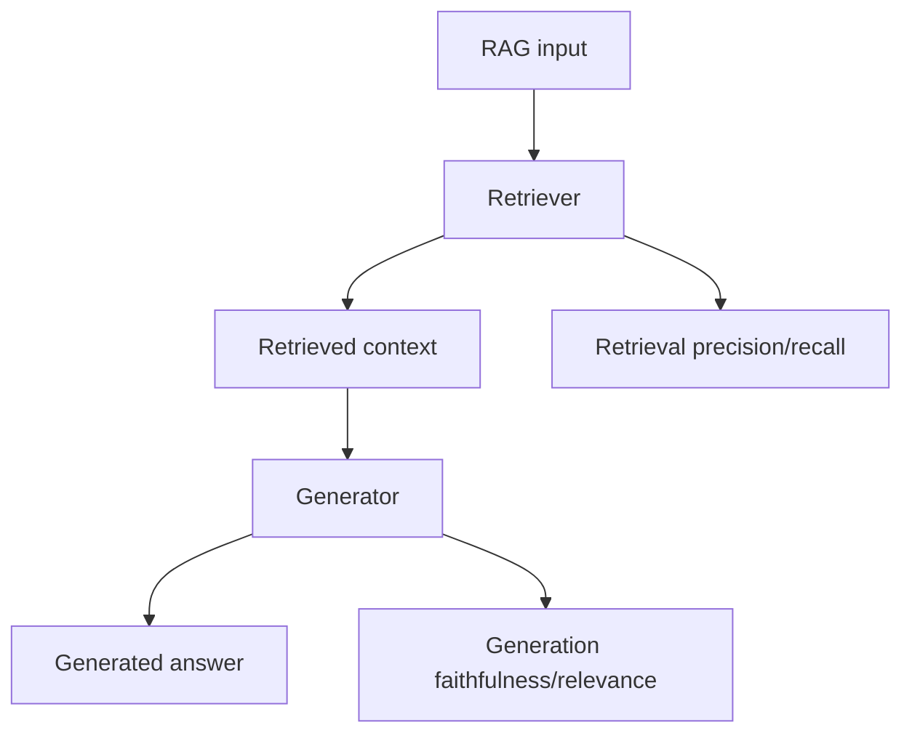

# RAG 평가: 정밀도 및 재현율

> RAG 시스템은 검색 및 생성을 평가해야 합니다. 검색 평가는 검색기의 정밀도와 재현율을 측정합니다. 생성 평가는 생성된 답변의 충실도(맥락과 일치)와 관련성(질문에 답변)을 측정합니다. 이 레슨은 RAG 평가기를 구현합니다: 검색 정밀도/재현율(레슨 65-66의 검색기용) 및 생성 충실도/관련성(생성기용).

**Type:** Build
**Languages:** Python
**Prerequisites:** Phase 19 lessons 64-67
**Time:** ~90 minutes

## Learning Objectives

- 정밀도, 재현율 및 F1을 포함한 RAG 시스템에 대한 검색 정밀도/재현율 메트릭을 구현합니다.
- 생성된 답변의 충실도(맥락과 일치)와 관련성(질문에 답변)을 평가하는 생성 평가기를 구현합니다.
- RAG 파이프라인(레슨 69)에 평가기를 연결합니다.

## The Problem

RAG 시스템은 검색기와 생성기를 결합합니다. 검색기 평가는 검색기가 관련 문서를 검색하는지 확인합니다. 생성기 평가는 생성기가 검색된 맥락에서 정확한 답변을 생성하는지 확인합니다. 두 가지 모두 평가되어야 합니다.

## The Concept



### Retrieval precision/recall

검색 평가는 검색기가 찾는 관련 문서의 비율을 측정합니다.

- **Precision** - 검색된 문서 중 관련성 있는 문서의 비율.
- **Recall** - 총 관련 문서 중 검색된 관련 문서의 비율.
- **F1** - 정밀도와 재현율의 조화 평균.

### Generation faithfulness/relevance

생성 평가는 생성된 답변의 품질을 측정합니다.

- **Faithfulness** - 생성된 답변이 검색된 맥락과 일치하는 정도. 생성된 진술이 맥락에 의해 지원되지 않으면 불충실합니다(환각).
- **Relevance** - 생성된 답변이 쿼리에 답변하는 정도. 생성된 내용이 질문과 관련이 없으면 무관합니다.

## Build It

`code/main.py` implements:

- `RetrievalEval` - 검색 정밀도, 재현율 및 F1을 계산합니다.
- `GenerationEval` - 생성 충실도 및 관련성을 계산합니다(LLM-as-judge 사용).
- `RAGEvaluator` - RAG 평가기를 연결하고 집계 메트릭을 생성합니다.

파일 하단의 데모는 RAG 파이프라인을 시뮬레이션하고, 검색 및 생성 평가를 실행하고, 집계 메트릭을 출력합니다.

Run it:

```bash
python3 code/main.py
```

스크립트는 0으로 종료되고 검색 정밀도/재현율 및 생성 충실도/관련성을 출력합니다.

## Production Patterns

세 가지 패턴이 이 레슨을 프로덕션 RAG 평가로 확장합니다.

**Evaluation on multiple datasets.** RAG 평가는 여러 데이터셋에서 실행되어야 합니다. 단일 데이터셋의 성능은 일반화되지 않습니다.

**Human evaluation for faithfulness/relevance.** LLM-as-judge는 인간 판단과 완벽하게 상관되지 않습니다. 생성 충실도 및 관련성은 때때로 인간에 의해 평가되어야 합니다.

**End-to-end RAG evaluation.** RAG 시스템은 엔드-투-엔드로 평가되어야 하며, 검색과 생성을 분리해서가 아닙니다. 엔드-투-엔드 평가는 검색 오류와 생성 오류가 함께 누적되는 방식을 포착합니다.

## Use It

프로덕션 패턴:

- **Evaluate on held-out test set.** 검증 세트에서의 검색 및 생성 평가는 모델 선택을 안내합니다. 최상의 검색 및 생성 하이퍼파라미터는 테스트 세트에서 선택됩니다.
- **Human evaluation for critical domains.** 의료 또는 법률과 같은 중요한 도메인의 경우 생성 충실도에 대한 인간 평가가 필요합니다.
- **Error analysis.** 검색 실패(관련 문서 없음)와 생성 실패(관련 문서가 있지만 잘못된 답변 생성)를 분류하면 시스템 개선이 안내됩니다.

## Ship It

`outputs/skill-rag-eval.md`는 실제 프로젝트에서 사용할 데이터셋, 평가가 실행되는 빈도 및 인간 검토가 필요한 시점을 설명합니다. 이 레슨은 엔진을 제공합니다.

## Exercises

1. 검색 평가에 MRR(평균 상호 순위)을 추가합니다.
2. 생성 평가에 BLEU를 추가합니다.
3. 검색 및 생성 평가를 위한 데이터셋 정의를 YAML 파일로 외부화합니다.
4. 각 평가 작업의 실행 간 변동성을 측정하기 위해 여러 시드에 걸쳐 평가를 실행하는 `--num-seeds` 플래그를 추가합니다.
5. 생성 충실도 평가를 위해 인간 평가 수집을 시뮬레이션합니다.

## Key Terms

| Term | What people say | What it actually means |
|------|-----------------|------------------------|
| Retrieval precision | "Accuracy of retrieval" | 검색된 문서 중 관련성 있는 문서의 비율 |
| Retrieval recall | "Coverage of retrieval" | 총 관련 문서 중 검색된 관련 문서의 비율 |
| Generation faithfulness | "No hallucination" | 생성된 답변이 검색된 맥락과 일치하는 정도 |
| Generation relevance | "Answers the query" | 생성된 답변이 쿼리에 답변하는 정도 |
| LLM-as-judge | "LLM evaluates" | 생성 품질 평가를 위한 LLM 사용 |

## Further Reading

- [Es et al., RAGAS: Automated Evaluation of Retrieval Augmented Generation (arXiv 2309.15217)](https://arxiv.org/abs/2309.15217) - RAG 평가를 위한 프레임워크
- [Liu et al., Evaluating Verifiability in Generative Search Engines (arXiv 2304.09848)](https://arxiv.org/abs/2304.09848) - 생성 충실도 평가
- [Kamalloo et al., Evaluating the Evaluators (arXiv 2310.01413)](https://arxiv.org/abs/2310.01413) - LLM-as-judge 평가의 한계
- Phase 19 · 64 - 고급 청킹 전략(이 평가가 평가하는 청크)
- Phase 19 · 65 - 하이브리드 검색(이 평가가 평가하는 검색)
- Phase 19 · 66 - 재순위화기(이 평가가 평가하는 재순위화)
- Phase 19 · 67 - 쿼리 재작성(이 평가가 평가하는 재작성)
- Phase 19 · 69 - 엔드-투-엔드 RAG 시스템(이 평가가 연결되는 대상)
