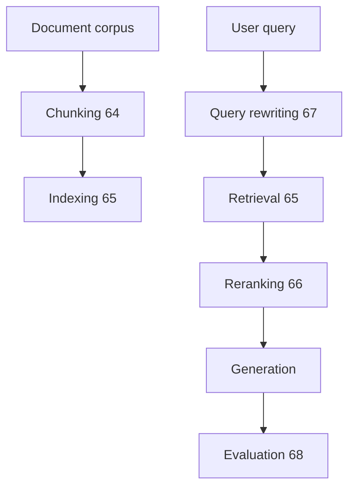

# 엔드-투-엔드 RAG 시스템

> RAG 시스템은 검색기와 생성기를 결합하여 LLM이 외부 지식에 접근할 수 있게 합니다. 엔드-투-엔드 RAG 시스템은 이전 5개 레슨(레슨 64-68)의 모든 구성 요소를 통합하는 통합 스크립트입니다: 청킹(64), 검색(65), 재순위화(66), 쿼리 재작성(67) 및 평가(68). 이 레슨은 코퍼스를 색인화하고, 엔드-투-엔드 RAG 쿼리를 실행하고, 검색 및 생성 메트릭을 보고하는 파이프라인을 구축합니다.

**Type:** Build
**Languages:** Python
**Prerequisites:** Phase 19 lessons 64-68
**Time:** ~90 minutes

## Learning Objectives

- 이전 5개 레슨의 구성 요소를 단일 RAG 파이프라인으로 통합합니다.
- 코퍼스를 색인화하고(청킹 + 검색기 색인화), RAG 쿼리를 실행하고(재작성 + 검색 + 재순위화 + 생성), 평가 메트릭을 보고합니다.
- 청킹 전략, 검색기, 재순위화기 및 쿼리 재작성기를 구성할 수 있는 파이프라인 설정 파일을 제공합니다.

## The Problem

검색 증강 생성(RAG) 시스템은 여러 구성 요소를 통합합니다: 청킹, 검색, 재순위화, 쿼리 재작성 및 생성. 이러한 구성 요소를 파이프라인으로 통합하는 통합 RAG 시스템이 필요합니다.

## The Concept



### Pipeline flow

파이프라인은 문서 코퍼스를 색인화하는 것으로 시작됩니다(청킹 + 검색기 색인화). 그런 다음 사용자 쿼리가 재작성(67)됩니다. 재작성된 쿼리가 검색(65)에 사용됩니다. 검색 결과가 재순위화(66)됩니다. 재순위화된 맥락이 생성기(LLM)에 공급되어 답변을 생성합니다. 마지막으로 답변이 평가(68)됩니다.

### Configuration

파이프라인은 YAML/JSON 설정 파일로 구성됩니다. 설정은 청킹 전략(레슨 64), 검색기 유형(BM25, 밀집, 하이브리드)(레슨 65), 재순위화기 활성화(레슨 66) 및 쿼리 재작성 전략(레슨 67)을 지정합니다.

## Build It

`code/main.py` implements:

- `RAGPipeline` - 색인화 및 쿼리 실행을 위한 단일 인터페이스로 모든 구성 요소를 통합합니다.
- `PipelineConfig` - YAML/JSON 설정 파일에서 RAG 설정을 읽습니다.
- `RAGDemo` - 설정을 읽고, 코퍼스를 색인화하고, 쿼리를 실행하고, 평가를 보고하는 데모 스크립트.

파일 하단의 데모는 합성 문서 코퍼스를 생성하고, 청킹 + 검색기 색인화로 색인화하고, 엔드-투-엔드 RAG 쿼리를 실행하고, 검색 및 생성 메트릭을 보고합니다.

Run it:

```bash
python3 code/main.py
```

스크립트는 0으로 종료되고 검색 및 생성 메트릭을 출력합니다.

## Production Patterns

세 가지 패턴이 이 레슨을 프로덕션 RAG 시스템으로 확장합니다.

**Pipeline observability.** 파이프라인의 각 단계는 로그를 기록하고 메트릭을 내보내야 합니다(지연 시간, 오류율). 단계별 로깅을 통해 각 단계가 예상대로 실행되는지 확인할 수 있습니다.

**Caching at every layer.** 쿼리 재작성, 검색 및 재순위화를 포함한 모든 단계는 캐시되어야 합니다. 캐싱은 반복되는 쿼리의 지연 시간을 줄입니다.

**Graceful degradation.** 구성 요소(예: 재순위화기)가 실패하면 파이프라인은 저하된 모드(재순위화 없이)에서 계속되어야 합니다. 단일 구성 요소 실패로 인해 전체 파이프라인이 실패해서는 안 됩니다.

## Use It

프로덕션 패턴:

- **Configuration-driven.** 파이프라인 동작은 설정에 의해 완전히 구동됩니다. 코드 변경 없이 청킹, 검색, 재순위화 및 재작성 전략을 구성할 수 있습니다.
- **Evaluate on held-out test set.** 검증 세트의 검색 및 생성 평가는 파이프라인 구성을 선택하는 데 사용됩니다. 최상의 구성은 테스트 세트에서 평가됩니다.
- **Human-in-the-loop evaluation.** 생성 평가(레슨 68)는 중요 답변에 대해 인간 검토자를 호출합니다.

## Ship It

`outputs/skill-e2e-rag.md`는 실제 프로젝트에서 사용할 RAG 설정, 색인된 코퍼스의 크기 및 평가가 실행되는 빈도를 설명합니다. 이 레슨은 엔진을 제공합니다.

## Exercises

1. 파이프라인 로깅을 추가합니다: 각 단계는 지연 시간과 오류율을 기록합니다.
2. 쿼리 재작성, 검색 및 재순위화에 대한 캐싱을 추가합니다.
3. 재순위화기 실패와 같은 오류를 처리하는 우아한 저하를 추가합니다.
4. 여러 쿼리 구성(예: 재작성 없음 vs. 재작성, 재순위화 없음 vs. 재순위화)을 비교하는 A/B 테스트 모드를 추가합니다.
5. 각 단계와 완료된 파이프라인의 엔드-투-엔드 메트릭을 보고하는 평가 모드를 추가합니다.

## Key Terms

| Term | What people say | What it actually means |
|------|-----------------|------------------------|
| RAG pipeline | "Retrieve-Augment-Generate" | 검색, 재순위화 및 생성을 결합한 엔드-투-엔드 파이프라인 |
| Pipeline configuration | "RAG config" | 파이프라인 동작을 제어하는 YAML/JSON 설정 파일 |
| Graceful degradation | "Fail softly" | 구성 요소가 실패할 때 저하된 모드에서 계속 |
| Pipeline observability | "Monitor pipeline" | 각 단계의 로깅 및 메트릭 |

## Further Reading

- [Lewis et al., Retrieval-Augmented Generation for Knowledge-Intensive NLP Tasks (NeurIPS 2020)](https://arxiv.org/abs/2005.11401) - RAG의 원본 논문
- [Chen et al., Evaluating and Enhancing the Robustness of Retrieval-Augmented Generation (arXiv 2310.01413)](https://arxiv.org/abs/2310.01413) - RAG 강건성 평가
- Phase 19 · 64 - 고급 청킹 전략(파이프라인 단계)
- Phase 19 · 65 - 하이브리드 검색(파이프라인 단계)
- Phase 19 · 66 - 재순위화기(파이프라인 단계)
- Phase 19 · 67 - 쿼리 재작성 HyDE(파이프라인 단계)
- Phase 19 · 68 - RAG 평가 정밀도/재현율(파이프라인 단계)
