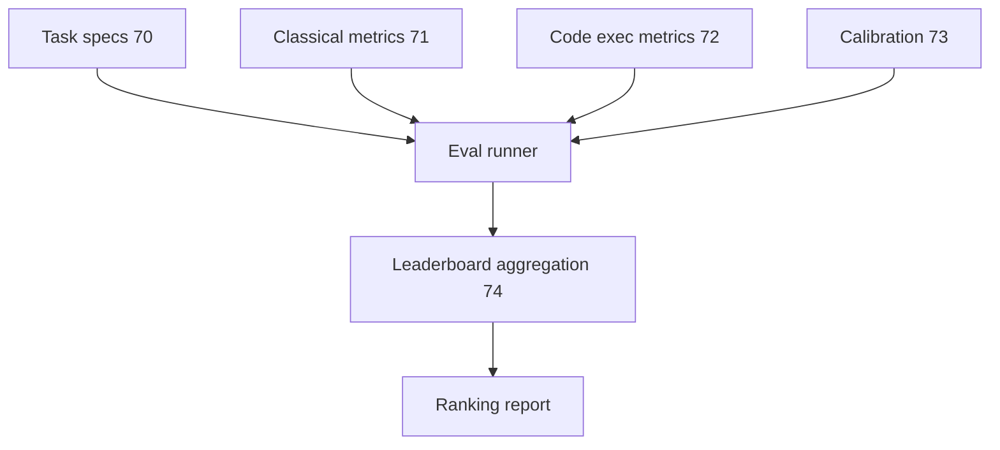

# 엔드-투-엔드 평가 러너

> 평가 러너는 이전 6개 레슨(레슨 70-75)의 모든 평가 구성 요소를 통합하는 통합 스크립트입니다: 작업 사양(70), 고전 메트릭(71), 코드 실행 메트릭(72), perplexity 교정(73) 및 리더보드 집계(74). 이 레슨은 작업 사양을 읽고, 평가를 실행하고, 메트릭을 계산하고, 결과를 집계하고, 리더보드에 제출하는 엔드-투-엔드 평가 러너를 구축합니다.

**Type:** Build
**Languages:** Python
**Prerequisites:** Phase 19 lessons 70-74
**Time:** ~90 minutes

## Learning Objectives

- 엔드-투-엔드 평가 러너를 구축합니다: 작업 사양 읽기, 평가 실행, 메트릭 계산, 결과 집계, 리더보드에 제출.
- 이전 5개 레슨에서 모든 메트릭이 올바르게 계산되는지 확인합니다.

## The Problem

평가는 여러 구성 요소로 분할됩니다: 작업 사양(70), 메트릭(71-73), 리더보드 집계(74). 평가 러너는 이를 단일 스크립트로 통합합니다.

## The Concept



### Pipeline flow

평가 러너는 작업 사양(레슨 70)을 읽습니다. 각 작업에 대해 러너는 모델 추론을 실행하고, 적절한 메트릭(레슨 71-73)을 계산합니다. 메트릭은 집계되고(레슨 74) 순위 보고서가 생성됩니다.

### Integration

통합은 작업 사양이 메트릭을 참조함으로써 이루어집니다. 각 작업 사양은 사용할 메트릭을 지정합니다. 평가 러너는 메트릭을 등록하고 이름으로 조회합니다(레슨 70의 `metric` 필드).

## Build It

`code/main.py` implements:

- `EvalRunner` - 작업 사양을 읽고, 평가를 실행하고, 메트릭을 계산하는 통합 평가 러너.
- `MetricRegistry` - 메트릭을 등록하고 이름으로 조회합니다.
- `E2EDemo` - 작업 사양을 읽고, 평가 데모를 실행하고, 순위 보고서를 출력합니다.

파일 하단의 데모는 합성 작업 사양을 생성하고, 평가를 실행하고, 메트릭을 집계하고, 순위 보고서를 출력합니다.

Run it:

```bash
python3 code/main.py
```

스크립트는 0으로 종료되고 순위 보고서를 출력합니다.

## Production Patterns

세 가지 패턴이 이 레슨을 프로덕션 평가 인프라로 확장합니다.

**Parallel evaluation.** 작업은 병렬로 실행될 수 있습니다. 평가 러너는 여러 워커에 걸쳐 작업을 분산해야 합니다.

**Caching model outputs.** 모델 출력은 캐시되어야 합니다. 동일한 모델-작업 쌍의 재평가는 캐시된 출력을 재사용해야 합니다.

**Checkpointing long evaluations.** 긴 평가(많은 작업 포함)는 체크포인트되어야 합니다. 체크포인트는 충돌 후 재개를 허용합니다.

## Use It

프로덕션 패턴:

- **CI integration.** 평가 러너는 CI/CD 시스템에 통합될 수 있습니다. 풀 리퀘스트는 리더보드에 결과를 자동으로 제출합니다.

## Ship It

`outputs/skill-e2e-eval-runner.md`는 실제 프로젝트에서 사용할 평가 작업, 메트릭이 등록되는 방법 및 평가가 병렬로 실행되는 방법을 설명합니다.

## Exercises

1. 여러 워커에 걸쳐 작업을 분산하는 병렬 평가를 추가합니다.
2. 모델 출력 캐싱을 추가합니다.
3. 긴 평가를 위한 체크포인팅을 추가합니다.
4. CI 통합을 추가합니다.
5. 평가 결과를 JSON 파일로 내보내는 `--export-json` 플래그를 추가합니다.

## Key Terms

| Term | What people say | What it actually means |
|------|-----------------|------------------------|
| Eval runner | "Eval harness" | 작업 사양 읽기, 평가 실행, 메트릭 계산의 통합 |
| Metric registry | "Metric lookup" | 메트릭을 등록하고 이름으로 조회 |
| Parallel evaluation | "Multi-worker" | 여러 워커에 걸친 분산 작업 |
| Model output caching | "Cache outputs" | 모델 출력 저장 및 재사용 |

## Further Reading

- [EleutherAI LM Evaluation Harness](https://github.com/EleutherAI/lm-evaluation-harness) - 유사한 평가 러너
- Phase 19 · 70 - 작업 사양 형식
- Phase 19 · 71 - 고전 메트릭
- Phase 19 · 72 - 코드 실행 메트릭
- Phase 19 · 73 - Perplexity 교정
- Phase 19 · 74 - 리더보드 집계
