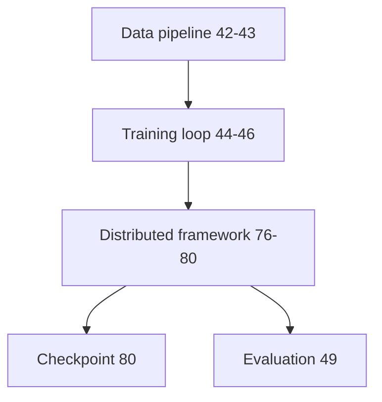

# 엔드-투-엔드 분산 훈련

> 분산 훈련은 여러 구성 요소를 결합합니다: DDP/ZeRO(레슨 77-78), 파이프라인 병렬 처리(레슨 79), 그라디언트 누적(레슨 46) 및 분산 체크포인트(레슨 80). 엔드-투-엔드 분산 훈련 스크립트는 이를 통합하여 단일 진입점을 제공합니다. 이 레슨은 청킹(42), 토큰화(43), 훈련 루프(44-46) 및 분산 구성 요소(76-80)를 포함한 엔드-투-엔드 분산 훈련 스크립트를 구축합니다.

**Type:** Build
**Languages:** Python
**Prerequisites:** Phase 19 lessons 42-46, 76-80
**Time:** ~90 minutes

## Learning Objectives

- 다운로드(42)에서 분산 훈련(76-80) 및 평가(49)까지의 엔드-투-엔드 분산 훈련 스크립트를 통합합니다.
- 구성 요소 간의 데이터 흐름이 손실, 메트릭 및 GPU 활용도에 대해 올바른지 확인합니다.

## The Problem

분산 훈련은 여러 구성 요소를 통합합니다: 데이터 파이프라인(42-43), 훈련 루프(44-46), 분산 프레임워크(76-80) 및 평가(49). 엔드-투-엔드 스크립트는 통합 진입점을 제공합니다.

## The Concept



### Pipeline flow

데이터 파이프라인(레슨 42-43)은 토큰화된 훈련 데이터를 생성합니다. 훈련 루프(레슨 44-46)는 분산 프레임워크(레슨 76-80)를 사용하여 데이터에 대해 모델을 훈련합니다. 체크포인트(레슨 80)는 저장되고 로드됩니다. 평가(레슨 49)는 훈련된 모델의 메트릭을 계산합니다.

## Build It

`code/main.py` implements:

- `DistributedTrainPipeline` - 다운로드(42), 토큰화(43), 훈련(44-46), 분산(76-80) 및 평가(49)를 통합하는 엔드-투-엔드 분산 훈련 파이프라인.
- `DistributedConfig` - 모든 분산 설정을 포함하는 구성 데이터 클래스.

파일 하단의 데모는 합성 데이터로 엔드-투-엔드 분산 훈련을 시뮬레이션합니다.

Run it:

```bash
torchrun --nproc_per_node=4 python3 code/main.py
```

스크립트는 0으로 종료되고 훈련 요약을 출력합니다.

## Production Patterns

세 가지 패턴이 이 레슨을 프로덕션 분산 훈련으로 확장합니다.

**Hybrid parallelism (DDP + pipeline + ZeRO).** 대규모 분산 훈련은 종종 DDP(데이터 병렬), 파이프라인 병렬(모델 분할) 및 ZeRO(메모리 최적화)를 결합합니다.

**Elastic training.** 분산 훈련은 노드 추가/제거를 처리해야 합니다. 탄력적 훈련은 하드웨어 장애를 허용합니다.

**Automatic mixed precision (AMP).** AMP(레슨 45)는 분산 훈련에서 처리량을 향상시킵니다.

## Use It

프로덕션 패턴:

- **Start with DDP, then add ZeRO/pipeline.** 분산 훈련을 DDP로 시작하고 필요에 따라 ZeRO 및 파이프라인 병렬 처리를 추가합니다.

## Ship It

`outputs/skill-e2e-distributed-train.md`는 실제 프로젝트에서 사용할 분산 전략(DDP+ZeRO+파이프라인), GPU 수 및 데이터셋 크기를 설명합니다.

## Exercises

1. 하이브리드 병렬 처리(DDP + 파이프라인 + ZeRO)를 제어하는 `--distributed-strategy` CLI 플래그를 추가합니다.
2. 분산 훈련을 위한 AMP(레슨 45) 통합을 추가합니다.
3. 단일 GPU 훈련과 분산 훈련의 처리량을 비교하는 벤치마크 모드를 추가합니다.
4. 분산 훈련을 위한 탄력적 훈련(노드 추가/제거)을 추가합니다.
5. 분산 훈련을 위한 체크포인트(레슨 80) 통합을 추가합니다.

## Key Terms

| Term | What people say | What it actually means |
|------|-----------------|------------------------|
| Hybrid parallelism | "DDP + pipeline + ZeRO" | 데이터, 파이프라인 및 메모리 최적화 병렬 처리를 결합 |
| Elastic training | "Node hot-swap" | 노드 추가/제거를 허용하는 분산 훈련 |
| End-to-end pipeline | "Full training script" | 데이터 파이프라인 + 훈련 + 평가를 통합 |

## Further Reading

- [Narayanan et al., Efficient Large-Scale Language Model Training on GPU Clusters Using Megatron-LM (SC 2021)](https://arxiv.org/abs/2104.04473) - 하이브리드 병렬 처리
- [PyTorch Distributed Elastic](https://pytorch.org/docs/stable/elastic.html) - 탄력적 훈련
- Phase 19 · 42-46 - 데이터 파이프라인 및 훈련 루프
- Phase 19 · 76-80 - 분산 프레임워크
- Phase 19 · 49 - 평가
