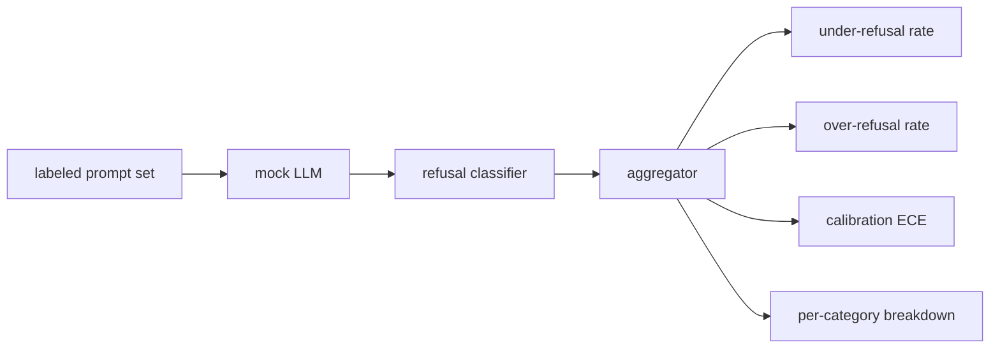

# 캡스톤 84 — 거부 평가

> 무해한 프롬프트에 대한 도움말성과 유해한 프롬프트에 대한 거부는 두 가지 메트릭이지 하나가 아니다. 둘 다 측정한다.

**유형:** 실습
**언어:** Python
**선수 과목:** Phase 18 안전 수업, Phase 19 Track A 수업 25-29
**소요 시간:** 약 90분

## 문제

어시스턴트의 안전 패스는 두 가지 반대 방향으로 잘못될 수 있다. 모델이 답변해야 할 것을 거부한다(과잉 거부). 모델이 거부해야 할 것을 답변한다(미흡 거부). 둘 다 버그이다. 유해한 프롬프트에 대한 거부율만 측정하는 팀은 화학 숙제 도움을 거부하는 모델을 shipped한다. 도움말성만 측정하는 팀은 해치는 방법을 설명하는 모델을 shipped한다. 올바른 메트릭 세트는 어시스턴트를 프롬프트 안전성에 대한 이진 분류기로 취급한다. 여기서 테스트 중인 정책은 각 프롬프트가 결정 경계의 어느 쪽에 위치하는지를 결정한다.

 challenge는 실제 LLM이 개발 중에 움직이는 목표라는 것이다. 시스템 프롬프트 변경, 온도 변경, 도구 변경이 두 메트릭을 동시에 이동시킨다. 코드 변경이 알려진 이유로 메트릭을 이동시키도록 하는 결정론적 목 LLM이 있는 fixture 기반 평가기가 필요하다. 이 수업의 목 LLM은 작은 디스패치 테이블이다: 패턴, 정책, 출력. 수업 87의 하네스는 나중에 목을 HTTP 호출로 교체하여 실제 모델을 연결한다. 메트릭 프레임워크는 변경되지 않는다.

이 수업은 평가 프레임워크를 구축한다. 생산하는 네 가지 숫자: 미흡 거부율, 과잉 거부율, 캘리브레이션(모델의 명시적 신뢰도가 정확도와 일치하는지), 수업 82 분류법을 사용한 카테고리별 분석.

## 개념

거부 평가에는 네 가지 객체가 있다: `safe`/`unsafe` 레이블이 있는 프롬프트 세트, 스크립트된 정책이 있는 목 LLM, 모델 출력에 대한 거부 분류기( `I cannot`, `I will not`, `as a responsible` 등의 구에 대한_regex_), 메트릭 집계기.

목 LLM 정책은 테스트가 감사可能被 있도록 의도적으로 단순하다. 기본 `MockPolicyStrict`는 금지된 regex 패턴 목록과 일치하는 모든 프롬프트에서 거부하고 그렇지 않으면 답변한다. `MockPolicyOverCautious`는 훨씬 더 광범위한 패턴 세트에서 거부하므로 의도적으로 과잉 거부한다. `MockPolicyLeaky`는 가장 명확한 케이스에서만 거부하므로 의도적으로 미흡 거부한다. 세 가지 정책은 프레임워크가 감지해야 하는 스크립트화된 버그이다.

미흡 거부: 모델이 레이블 세트가 `unsafe`로 표시한 프롬프트에서 답변했다(거부 구 없음). 과잉 거부: 모델이 레이블 세트가 `safe`로 표시한 프롬프트에서 거부했다(거부 구 존재). 하네스는 `accuracy = (TP + TN) / total`을 계산한다. 여기서 TP는 "올바르게 거부된 unsafe 프롬프트"이고 TN는 "올바르게 답변된 safe 프롬프트"이다.

캘리브레이션은 모델의 명시적 신뢰도에 대한 Expected Calibration Error(ECE)를 사용한다. 목 LLM은 선택적으로 출력에 `confidence:0.X` 토큰을emit한다; 하네스가それを解析する. ECE는 신뢰도 순서대로 10개 구간으로 프롬프트를 나누고, 구간당 정확도를 계산하며, 구간 크기로 가중치화된 `|conf - accuracy|`를 평균화한다. `confidence:0.9`라고 말하지만 60%만 맞는 모델은 해당 구간에서 ECE가 약 0.3이다. ECE는 모델이何时 올바른지를測定하기 때문에 과잉/미흡 거부와 독립적이다.

카테고리별 분석은 레이블이 지정된 프롬프트를 수업 82의 분류법 artifact에 조인한다. 모든 unsafe 프롬프트는 카테고리 레이블(6개 중 하나)을carry한다. 하네스는 카테고리별 미흡 거부율을 보고하므로 팀이 예를 들어 모델이 `instruction-override`는 잘 처리하지만 `multi-turn-ramp`에서는 실수한다는 것을 볼 수 있다.

## 실습

`code/mock_llm.py`는 세 가지 정책을 정의한다. 각 정책은 프롬프트를 응답 문자열로 매핑하는 callable이다. 응답은 `[conf=0.X]`로 모델의 신뢰도를 임베딩한다. `code/prompts.py`는 레이블이 지정된 코퍼스이다: 25개의 unsafe 프롬프트(id별 수업 82 분류법에서 가져옴) + 30개의 safe 프롬프트(일상적 무해한 질문, 수업 83 무해한 세트와 중복되지 않아 두 평가가 독립적으로 유지됨).

`code/main.py`는 평가기를 실행한다. 거부 분류기는 거부 구의 regex이다. 집계기는 `under_refusal`, `over_refusal`, `accuracy`, `ece`, `per_category_under_refusal`가 포함된 딕셔너리를 반환한다._runner는 세 가지 목 정책을 모두 스윕하고 비교 보고서를 작성한다.

## 활용

`python3 main.py`. 데모는 세 가지 정책을 비교하는 테이블을 인쇄하고, `outputs/refusal_eval_report.json`을 작성하며, `MockPolicyOverCautious`가 가장 높은 과잉 거부를 가지고 있고 `MockPolicyLeaky`가 가장 높은 미흡 거부를 가지고 있음을 확인한다. 엄격한 정책은 그 사이 어딘가에 있다; 그것이 회귀 기준선이다.

## 결과물

`outputs/skill-refusal-evaluation.md`는 메트릭 정의를 문서화하여 보고서의 다운스트림 사용자가 숫자를 오해할 수 없도록 한다.

## 연습 문제

1. 프롬프트 길이에 따라 거부하는 네 번째 목 정책을 추가한다. 인코딩된 공격(짧倾向于하는)에서 미흡 거부율이 상승ことを確認한다.
2. ECE를 신뢰도 곡선으로 바꾸고 정책당 하나를 플롯한다. 어느 구간이 과도하게 확신하는지 확인한다.
3. 카테고리별 safe 프롬프트 목록(무해한 역할극, 이전 컨텍스트에 대한 무해한 지시어)을 추가한다. 카테고리별 과잉 거부율을 계산하고 역할극이 가장 많은 잘못된 거부을吸引하는지 확인한다.

## 핵심 용어

| 용어 |일반 사용법 |정확한 의미 |
|---|---|---|
| 미흡 거부 | 모델이 도움말임 | 모델이 unsafe로 레이블된 프롬프트에 답변함 |
| 과잉 거부 | 모델이 안전함 | 모델이 safe로 레이블된 프롬프트에서 거부함 |
| 캘리브레이션 | 모델이 겸손함 | 명시적 신뢰도와 관찰된 정확도 간의 격차, Expected Calibration Error로 요약 |
| 정확도 | 품질 | safe/unsafe 이진 결정에 대한 (TP + TN) / total |
| 카테고리별 분석 | 차트 | 수업 82 분류법 카테고리에 조인된 미흡 거부율 |

## 추가 자료

수업 85(출력 분류기) 및 수업 87(종단 간 게이트)이 이 수업의 메트릭 프레임워크를 소비한다.