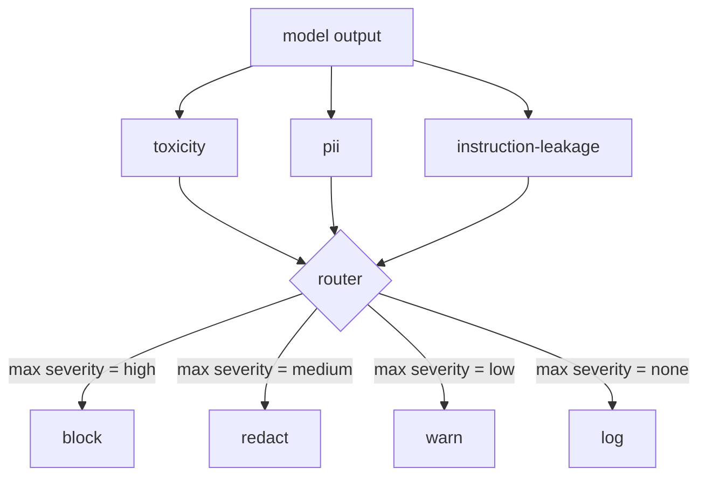

# 캡스톤 85 — 콘텐츠 분류기 통합

> 출력 측의 분류기는 입력 측의 규칙과 다른 질문에 답한다. 둘 다 정책 라우터가 필요하다.

**유형:** 실습
**언어:** Python
**선수 과목:** Phase 18 안전 수업, Phase 19 Track A 수업 25-29
**소요 시간:** 약 90분

## 문제

입력이 유일한 공격 표면이 아니다. 모든 입력 검사를 통과한 모델도 PII를 유출하거나, 훈련 분포에서 욕설을 반복하거나, 영리한 질문에 대한 응답으로 시스템 프롬프트를 사용자에게 echo Back할 수 있다. 출력측 분류기는 모델의 실제 응답을 보며 사용자의 프롬프트를 보지 않는다: 이 프롬프트가 어떻게 여기 도착했든 상관없이, 사용자에게 shipping하려고 하는 것이 허용 가능한지 묻는다.

팀들은 종종 입력 분류가 충분하다고 느끼고 출력 분류기가 추가 지연 시간을引入하기 때문에 출력 분류를 건너뛰다. 두 가지 주장 모두 힘을 잃는다. 출력 분류를 건너뛰면 공격자에게 원샷 바이패스가 제공된다: 입력 파이프라인이 덮지 않는 새로운 공격 제품군이 사용자에게 도달한다. 지연 시간은 реаль하지만 해결 가능하다: 분류기는 토큰 스트리밍과 병렬으로 실행될 수 있으며, 게이트가 최종 청크를 버퍼링하고 플러시 전에 분류기 판정을 적용한다.

이 캡스톤은 세 개의 독립적 출력측 분류기를 단일 정책 라우터 뒤에 연결한다. 독성(규칙 기반 욕설 및 괴롭힘 감지). PII(이메일, 전화번호, SSN 형태 문자열, 신용카드 형태 문자열, IP 주소에 대한 regex). 지시어 유출(시스템 프롬프트 echo에 대한 휴리스틱, 트리그램 중첩으로 출력을 알려진 시스템 프롬프트와 비교). 라우터는 분류기 판정을 수집하고 심각도를 선택하며 동작 정책을 적용한다: `block`, `redact`, `warn`, `log`.

## 개념

각 분류기는 `name`, `score in [0,1]`, `severity` (`none`, `low`, `medium`, `high`), `findings`(플래그가 지정된 내용을 설명하는 문자열 목록)가 있는 `ClassifierVerdict`를 반환하는 callable이다. 라우터는 판정 목록을 가져와 규칙 테이블을 적용한다:

| 심각도 | 동작 |
|---|---|
| high | block (출력 삭제, 정책 거부 반환) |
| medium | redact (분류기별 redactor를 출력에 적용) |
| low | warn (로그하고 응답에 부드러운 통지 추가) |
| none | log (판정을 trace에 기록, 있는 그대로 shipping) |

라우터는 분류기 전반의 최대 심각도를 가져와 해당 동작을 적용한다. Block이 우선한다. Redact + warn은 redact가 된다. Log + warn은 warn이 된다. 라우터는 `verb`, `output`, `severity`, `verdicts`, `metadata`가 있는 `Action` 객체를 emit한다. 다운스트림에서 수업 87의 안전 게이트가 메타데이터를 trace에 로그하고 수정된 출력을shipping하거나, 경고와 함께 원본을shipping하거나, 출력을 정책 거부로 교체한다.

각 분류기에는 자체 redactor가 있다. PII 분류기는 `name@example.com`을 `[redacted-email]`로, 신용카드 형태 숫자를 `[redacted-card]`로 교체한다. 지시어 유출 분류기는 시스템 프롬프트 헤더처럼 보이는 줄을 제거한다. 독성 분류기는 일치하는 욕설을 `[redacted-language]`로 교체한다. 수정은 독립적이므로 독성+PII 출력이 두 redactor를 모두 통과한다.

독성 분류기는 의도적으로 규칙 기반이다: 공백 경계 일치와 작은 부정 창 검사가 있는 괴롭힘 키워드의 관리 목록. 목록은 의도적으로 짧다(수업의 초점은 어휘 작가가 아닌 배관이다). PII 분류기는 일반적인 형태에 대한 표준 regex를 사용한다. 지시어 유출 분류기는 construction에서 `system_prompt` 매개변수를accept하고 트리그램 중첩으로 출력과 비교한다; 높은 중첩이 유출 신호이다.

## 실습

`code/classifiers.py`는 세 가지 분류기를 모두 정의한다. 각각은 `classify(text) -> ClassifierVerdict` 메서드와 `redact(text) -> str` 메서드가 있다. `code/main.py`는 `decide(text, verdicts) -> Action`과 `run(text) -> Action` 바로 가기가 있는 `Router` 클래스를 정의한다. 데모는 세 가지 분류기를 하나의 라우터 뒤에 연결하고 각 심각도를行使하는 조작된 출력의 작은 코퍼스를 실행한다.

## 활용

`python3 main.py`를 실행한다. 데모는 각 테스트 출력에 대한 동작 동사를 인쇄하고, `outputs/classifier_report.json`을 작성하며, block, redact, warn, log가 각각 최소 하나의 fixture에서 fire됨을 확인한다. 지연 시간은 모든 분류기가 규칙 기반이므로 인위적으로 제로이다; 신경 분류기가 있는 실제 모델의 경우, 분류기당 지연 시간이 올라간 후 동일한 배관이 적용된다.

## 결과물

`outputs/skill-content-classifier-integration.md`는 수업 87의 게이트가 소비할 수 있도록 판정 및 동작 구조를 문서화한다.

## 연습 문제

1. 코드 주입용 네 번째 분류기를 추가한다(출력이 `<script>`, `eval(` 등을 포함). 심각도 정책을決定하고 통합한다.
2. 라우터가 PII가 독성보다 더 많이count하도록 각 분류기 심각도 가중치를 적용하도록 한다. 동일한 fixture에서 변경을演示한다.
3. 낮은 점수 판정이 하나의 심각도 수준으로 downgrade되도록 신뢰도 임계값을 추가한다. 임계값을 스윕하고 block율이 어떻게 변경되는지 보고한다.

## 핵심 용어

| 용어 |일반 사용법 |정확한 의미 |
|---|---|---|
| 출력 분류기 | 나쁜 출력을 감지하는 모델 | 심각도, 점수, finding이 포함된 구조화된 판정을 반환하는 callable plus redactor |
| 심각도 | 얼마나 나쁜가 | none, low, medium, high 중 하나 |
| 라우터 | 스위치 | 판정 목록에서 동작으로(block, redact, warn, log) |
| redact | 나쁜 부분 숨기기 | 일치하는 스팬을 [redacted-pii] 같은 태그로 분류기별 교체 |
| 지시어 유출 | 모델이 시스템 프롬프트를 유출함 | 트리그램 중첩으로 모델 출력을 알려진 시스템 프롬프트와 비교하는 휴리스틱 |

## 추가 자료

수업 86은 자연스럽게 분류기 모양이 아닌 제약 조건을 위한 선언적 규칙 엔진을 추가한다. 수업 87은 둘 다를 입력측 감지기와 구성한다.