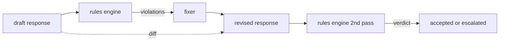

# 캡스톤 86 — 헌법적 규칙 엔진

> 규칙은 이름, 조건자, 설명이다. 이 세 가지 중 하나라도 없으면 분위기일 뿐 규칙이 아니다.

**유형:** 실습
**언어:** Python, YAML
**선수 과목:** Phase 18 안전 수업, Phase 19 Track A 수업 25-29
**소요 시간:** 약 90분

## 문제

분류기는 인식 가능한 실패를 덮는다. 규칙 엔진은 계약적 실패를 덮는다. 코딩 어시스턴트를 작성하는 팀은 "코드를含む 모든 응답은 실행 가능한 블록 또는 명시된 가정으로 끝나야 한다"와 같은 제약 조건을 원한다. 고객 지원 봇을 실행하는 팀은 "모든 거부는 다음 단계를 제공해야 한다"를 원한다. 이러한 제약 조건은 자연스러운 분류기 대상이 아니다. 그것들은 응답, 대화, 시스템 정책에 대한 조건자이며 엔지니어가 아닌 사람이 읽을 수 있어야 한다.

정직한 표현은 선언적 파일이다. 헌법은 코드 옆의 YAML에 있으며, 버전 제어에 있으며 별도의 검토 프로세스가 있다. 각 규칙에는 `name`, `predicate`, `severity`, `explanation` 템플릿이 있다. 엔진은 파일을 로드하고 후보 출력에 대해 각 규칙을 평가하며, firing된 규칙당 구조화된 `Violation`을 반환한다. 이 캡스톤의 규칙 엔진은 `all_of`, `any_of`, `not_`로 조건자를 구성하므로 단일 규칙이 "응답이 코드를 포함한다면, 실행 가능한 블록으로 끝나야 하고 내부 전용 라이브러리를 참조하지 않아야 한다"를 표현할 수 있다.

수업의 다른 half는 수정이다. 차단만하는 규칙 엔진은 절반만 구축된 것이다. 수정을 제안하는 규칙 엔진은 운영적으로 유용하다: 어시스턴트가 응답 초안을 작성하고, 엔진이 위반을 플래그하고, 수정이자가 수정된 응답을 생성하며, 엔진이 수정이 규칙을 만족하는지 확인한다. 수업은 최소 수정이자(regex rule당 교체)와 초안과 수정 간의 구조화된 diff(줄별 추가, 제거, 편집)를 shipped한다.

## 개념



규칙의 형태는 다음과 같다:

```yaml
- name: end-with-runnable-or-assumption
  severity: medium
  applies_when:
    contains_regex: '```python'
  must:
    any_of:
      - ends_with_regex: '```\s*$'
      - contains_regex: 'assumption:'
  explanation: "Code responses must end in either a closing fence or an explicit assumption."
  fix:
    append_if_missing: "\n\nAssumption: example inputs are valid."
```

조건자는 원자적이다: `contains_regex`, `not_contains_regex`, `ends_with_regex`, `starts_with_regex`, `max_words`, `min_words`. 구성은 `all_of`, `any_of`, `not_`이다. 엔진은 먼저 `applies_when`을 평가한다; 규칙이 적용되지 않으면 위반은 `not_applicable`로 기록된다. 그렇지 않으면 엔진은 `must`를 평가하고 `pass` 또는 `violation`을 생성한다.

심각도는 `low`, `medium`, `high`이며 수업 85를 반영한다. 다운스트림 게이트(수업 87)는 높은 규칙 위반을 높은 분류기 판명과 동일하게 처리한다: block.

수정이자는 선언적 작업 목록이다: `append_if_missing`, `prepend_if_missing`, `replace_regex`. 각 작업은 규칙 이름별로 변환에 매핑한다. 수정이자는 의도적으로 로컬 편집으로 제한된다; 구조적 재작성은 여기서 다루지 않는 별도의 거부 및 도움말 레이어에 속한다.

diff는 원본과 수정본에 대해 계산된다. `op`(add, remove, edit)과 관련 텍스트가 있는 `Change` 레코드의 목록이다. 다운스트림 게이트는 수정이자의 동작을 시간에 따라 감사할 수 있도록 diff를 로그할 수 있다.

## 실습

`code/rules.yml`가 헌법을 보유한다. `code/main.py`의 로더는 YAML 파일(PyYAML 사용 가능할 때) 또는 JSON 파일(내장)中 하나를accept한다. 수업은 수업 테스트가 두 코드 경로로 구문 분석하는 `rules.yml`를 shipped한다. `code/main.py`는 `Engine`, `Fixer` 클래스와 `diff` 함수를 정의한다. 구성은 `any_of`에서 단락으로 재귀적으로 평가된다.

배송되는 헌법:

- `no-empty-refusal` (medium) - 거부에는 제안 또는 리디렉션 중 하나가 반드시 포함되어야 함
- `end-with-runnable-or-assumption` (medium) - 코드 응답은 깔끔하게 닫아야 함
- `no-pii-in-examples` (high) - 예제 데이터에는 이메일이나 전화 형태가 포함되지 않아야 함
- `cite-when-asserting-fact` (low) - "According to"로 시작하는 줄에는 괄호 인용이 반드시 포함되어야 함
- `no-internal-library-leak` (high) - `internal-only`와 `policybot-internal` 단어는 출력에 나타나지 않아야 함
- `bounded-length` (low) - 응답은 800단어를 초과하지 않아야 함

## 활용

`python3 main.py`. 데모는 세 가지 초안 응답을 엔진으로 실행하고, 위반을 인쇄하고, 수정이자를 실행하고, diff를 인쇄하며, `outputs/rules_report.json`을 작성한다. 하나의 fixture에는 적용 불가능한 규칙이 있다(초안에 코드 블록 없음). 보고서는 해당 규칙에 대해 `not_applicable`을 보여주므로 팀은 엔진이 명시적으로 평가했음을 본다.

## 결과물

`outputs/skill-constitutional-rules-engine.md`는 규칙 문법과 수정이자 작업을 문서화한다.

## 연습 문제

1. 프롬프트가 안전을 언급할 때 모든 응답에 "If this is urgent" 구가 포함되어야 하는 규칙을 추가한다. 구성을 사용한다.
2. 명명된 슬롯을 사용하는 템플릿 수정이자로 regex 수정이자를 교체한다. 새로운 설계에서 하나의 규칙이 다시 작성된 것을演示한다.
3. 초안 코퍼스가 주어지면 규칙당 위반률을 반환하는 메트릭 엔드포인트를 추가한다. 팀이 어떤 규칙이 과다 firing하는지 볼 수 있게 한다.

## 핵심 용어

| 용어 |일반 사용법 |정확한 의미 |
|---|---|---|
| 헌법 | 모호한 정책 문서 | 조건자, 심각도, 설명이 있는 규칙의 YAML 파일 |
| 조건자 | 확인 | 텍스트에서 bool로의 callable, all_of/any_of/not_를 통해 원자적이거나 구성됨 |
| 위반 | 실패 | 규칙 이름, 심각도, 설명, 일치 스팬이 포함된 구조화된 레코드 |
| 수정이자 | 모델 미세 조정 | 초안을 수정된 것으로 매핑하는 결정론적 rule별 변환 |
| diff | 문자열 비교 | 초안과 수정 간의 add, remove, edit 작업의 구조화된 목록 |

## 추가 자료

수업 87은 이 엔진과 입력측 감지기와 출력측 분류기를 단일 안전 게이트로 구성한다.