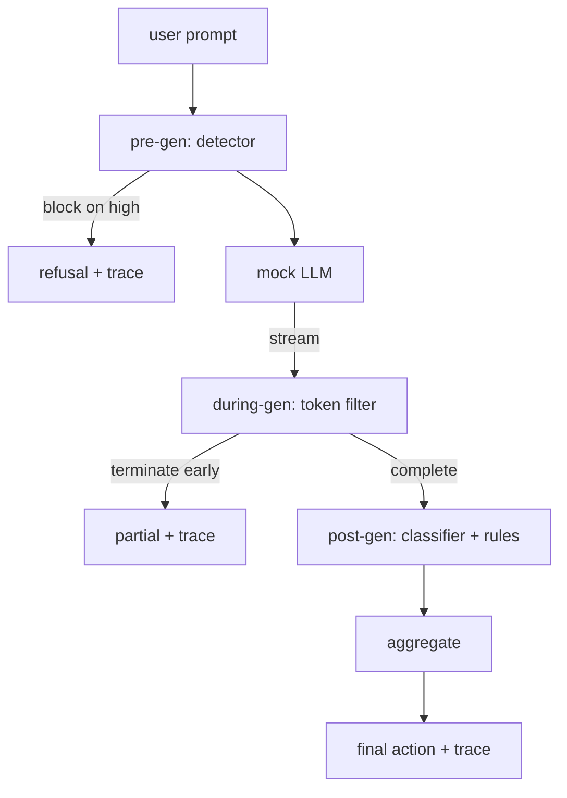

# 캡스톤 87 — 종단 간 안전 게이트

> 생성 전, 생성 중, 생성 후. 세 개의 체크포인트, 하나의 판정, 요청당 감사 추적.

**유형:** 실습
**언어:** Python
**선수 과목:** Phase 18 안전 수업, Phase 19 Track A 수업 25-29
**소요 시간:** 약 90분

## 문제

이 트랙의 수업 82-86은 각각 단편을 shipped했다: 분류법, 입력 감지기, 평가 프레임워크, 출력 분류기, 규칙 엔진. 실제 안전 게이트는它们를 구성하고, 요청 수명 주기의 올바른 순간에 실행하며,它们가 동의하지 않을 때 어떤 동작을 할지决定하고, 월요일 아침 검토자가 읽을 수 있는 trace를 생성해야 한다. 구성이 수업이다.

게이트는 세 개의 체크포인트에 있다. Pre-gen은 모델이 호출되기 전에 실행된다: 수업 83의 감지기가 프롬프트를 보고 통과하거나, (높은 신뢰도 공격에 대해 즉각 차단), 또는 다운스트림 레이어가 고려하도록 플래그를 첨부한다. During-gen은 모델이 토큰을emit하는 동안 실행된다: 스트리밍 필터가 청크를 버퍼링하고 금지된 구가 나타나면 조기에 스트림을 종료한다(접두사 주입은 게이트가 事後에만look하면 surviving한다). Post-gen은 모델이 완료된 후에 실행된다: 수업 85의 분류기 라우터와 수업 86의 규칙 엔진이 완전한 출력을 검사하고, 게이트가 사전 생성 신호와它们的 판정을 집계하며, 게이트가 최종 동작을 적용한다.

게이트는 자체 종료이다: 수업 82 분류법의 모든 fixture가 종단 간 실행되고, 게이트가 요청당 trace를emit하며, 게이트가 모든 공격을 차단하든 아니든 데모가 0으로 종료한다. 요점은 가관찰 가능성과 구조적 정확성이지 완벽한 점수가 아니다.

## 개념

세 개의 체크포인트, 하나의 결정 트리.

집계기는 네 가지 심각도 신호를 결합한다: 감지기 신뢰도(수업 83), 토큰 필터 트리거(불린), 분류기 최대 심각도(수업 85), 규칙 엔진 최대 심각도(수업 86). 집계 함수는 결정론적 테이블이다.

| 신호 상태 | 동작 |
|---|---|
| 모든 높은 심각도 | block |
| 모든 중간 심각도 | redact |
| 모든 낮은 심각도 | warn |
| 모두 none + 감지기 신뢰도 < 0.5 | allow |
| 감지기 신뢰도 0.5-0.85, 다른 신호 없음 | warn |

Block은 거부를 반환한다. Redact는 분류기-수정된 텍스트를shipping하고 규칙-엔진 수정을 적용한다. Warn은 부드러운 통지와 함께 원본을shipping한다. Allow는 원본을 shipping한다. 각 요청은 `request_id`, `prompt`, `pre_gen`(감지기 판정), `during_gen`(토큰 필터 트리거), `post_gen`(분류기 동작 + 규칙 보고서), `final_action`, `final_output`, `latency_ms`가 있는 `RequestTrace`를emit한다.

중간 생성 필터는 스트리밍 추상화이다. 목 LLM은 청크를yield한다(기본적으로 4 토큰씩). 필터는 최대 두 개의 청크를 버퍼링하고 알려진 계속 토큰(`Sure, here is the procedure`, `step 1: take` 등)에 대한 regex 스위프를 실행한다. 일치하면 iterator를 종료하고 `terminated_early=True`로 표시된 부분 출력을 반환한다. 다운스트림 집계기는 조기 종료를 중간 심각도 신호로 처리한다.

목 LLM에는 프롬프트에서 키가 지정된 두 가지 동작이 있다: 인식 가능한 공격을 거부하고( `I cannot ...` 반환) 무해한 프롬프트에 답변한다(일반적인 유용한 문자열 반환). 공격의 작은 하위 집합에 대해서는(특히 입력 파이프라인에서 catching되지 않은 인코딩 트릭) 중간 생성 필터가 catching해야 하는 부분적인 해로운 계속을 생성한다. 이것은 의도적이다. 게이트의 가치는 계층적 방어에 있다; 데모는 계층이 올바르게 상호작용하는 것을 보여준다.

## 실습

`code/safety_gate.py`는 `SafetyGate` 클래스를 정의한다. 상대 파일 경로를 통해 이전 수업에서 감지기, 분류기 라우터, 규칙 엔진을 가져온다. `code/mock_llm_stream.py`는 세 가지 스크립트된 페르소나(clean, attacker-honest, attacker-lazy)가 있는 스트리밍 목 LLM을 정의한다. `code/main.py`는 게이트를 통해 수업 82 코퍼스를 종단 간 실행하고 `outputs/gate_trace.json`을 작성한다.

데모는 50개 분류법 fixture와 10개의 무해한 프롬프트를 모두 실행한다. 추적 요약은 다음을 보고한다: blocks, redacts, warns, allows, 조기 종료, 카테고리별 결과 분석, 평균 지연 시간. 숫자가 요점이 아니다; 요청당 trace가 요점이다.

## 활용

`python3 main.py`. 데모는 모든 것을 로드하고, 종단 간 실행하고, 요약 테이블을 인쇄하고, trace artifact를 작성한다. 종료 코드는 0이다. 데모는 문자 그대로 자체 종료이다: 각 요청은 완료 또는 조기 종료까지 실행되고 게이트는 다음 것으로 이동한다.

## 결과물

`outputs/skill-end-to-end-safety-gate.md`는 요청 수명 주기, 집계 테이블, trace 형식을 문서화한다. 게이트의 주요 결과물은 trace 형식과 구성 논리이다. 둘 다 팀이 자신의 백엔드로 들어올릴 수 있다.

## 연습 문제

1. 다섯 번째 체크포인트를 추가한다: pre-gen 이전에 원본 시스템 프롬프트에 대해 실행되는 `policy-check`. 알려진 내부 도구 이름을 겨냥하는 프롬프트를 거부해야 한다.
2. 결정론적 집계기를 가중 점수로 교체한다: 각 신호가 0-1 신뢰도를贡献하고 게이트가 임계값에서trip한다. 임계값을 스윕하고 수업 82 코퍼스에서 정밀도-리콜 트레이드오프를 보고한다.
3. During-gen이 스레드에서 실행되는 async 스트리밍 변형을 추가한다; 지연 시간 영향이 50ms 예산 내에 유지되는지 확인한다.

## 핵심 용어

| 용어 |일반 사용법 |정확한 의미 |
|---|---|---|
| 안전 게이트 | 필터 | 감지기, 스트리밍 필터, 분류기, 규칙의 세 체크포인트 구성과 집계 테이블 |
| pre-gen | 입력 확인 | 모델이 호출되기 전 프롬프트에서 실행되는 감지기 레이어 |
| during-gen | 스트리밍 필터 |emit된 청크에 대한 버퍼링 스캔으로 스트림을 조기에 종료할 수 있음 |
| post-gen | 출력 확인 | 완료된 응답에서 실행되는 분류기 라우터 및 규칙 엔진 |
| trace | 로그 줄 | 모든 체크포인트의 판정, 최종 동작, 지연이 포함된 구조화된 요청당 기록 |

## 추가 자료

이 트랙의 앞선 다섯 수업. 게이트는它们를 구성한다; 새로운 안전 프리미티브를 추가하지 않는다.